# PROVISIONAL PATENT APPLICATION

CONSTRAINT-PROJECTED STATE COMPUTING SYSTEMS, SEMANTIC SYSTEM SPECIFICATION, AND APPLICATIONS

Inventor: Tristen Kyle Pierson

Applicant/Assignee: Tristen Kyle Pierson

Filing Date: February 11, 2026

---

### 1. TITLE

Constraint-Projected State Computing Systems, Semantic System Specification, and Applications

---

### 2. TECHNICAL FIELD

The present disclosure relates to computing systems and architectures. More particularly, the disclosure relates to deterministic computation performed by projecting system state into a space defined by explicit constraints, rather than by executing ordered instructions.

The disclosure further relates to methods for designing, specifying, and implementing such systems using a semantic system specification layer that expresses system intent, state roles, and invariant relationships independently of execution mechanics, and which is lowered into explicit constraint architectures suitable for execution by constraint-projected state computing engines.

The disclosed systems apply to both software and hardware implementations and support applications including, but not limited to, optimization, policy enforcement, scheduling, planning, configuration management, control systems, embedded sensing, security enforcement, real-time governance, artificial intelligence safety, mission-critical computing, and data compression.

---

### 3. BACKGROUND

Most contemporary computing systems are instruction-driven. Program execution is defined by ordered instruction streams, branching control flow, mutable execution state, and implicit runtime semantics. While effective for general-purpose computation, instruction-based systems are often ill-suited for domains governed primarily by rules, invariants, safety envelopes, policies, structural relationships, and correctness conditions.

Alternative approaches such as heuristic solvers, adaptive controllers, and machine-learned models frequently rely on probabilistic behavior, tuning, training, or stochastic execution. These approaches may lack deterministic replay, explicit failure modes, bounded convergence, or suitability for safety certification, particularly in embedded, real-time, or hardware-constrained environments.

Constraint programming systems and satisfiability solvers encode constraints declaratively, but typically operate as external solvers invoked episodically. Such systems do not define a unified execution model for system-wide state evolution, deterministic commit semantics, or continuous enforcement across software and hardware boundaries.

Optimization and numerical methods treat computation as convergence toward minima or fixed points of cost functions. These methods often rely on floating-point arithmetic, heuristic convergence criteria, or tolerance thresholds, and may not guarantee identical results across platforms, runs, or implementations.

Learned and adaptive systems, including neural networks and reinforcement learning systems, derive behavior from trained parameters rather than explicit constraints. Such systems may exhibit nondeterministic behavior, training drift, or opaque failure modes, and are difficult to certify for safety-critical or mission-critical applications.

In addition, existing system design practices frequently separate requirements documentation, implementation code, and validation logic, leading to semantic gaps between intended behavior and executed behavior. Correctness is often implicit, emergent, or distributed across code paths rather than explicitly declared.

Certain emerging computing paradigms, including quantum computing, further illustrate this gap. Existing quantum programming approaches typically describe low-level gate sequences, algorithm families, or Hamiltonian energy functions, and do not provide a stable, declarative layer for specifying what must be true of acceptable solutions, what constraints define correctness, or what invariants must hold across different hardware generations and algorithmic realizations. As a result, semantic intent is often entangled with execution methods and hardware details, complicating audit, governance, and long-term reuse.

In parallel, modern cryptographic systems rely heavily on public-key cryptography for authentication, integrity, and confidentiality. Anticipated advances in quantum computing have motivated the development and standardization of post-quantum cryptographic (PQC) algorithms, including module-lattice-based digital signatures (ML-DSA, formerly CRYSTALS-Dilithium), stateless hash-based signatures (SLH-DSA, formerly SPHINCS+), and module-lattice-based key-encapsulation mechanisms (ML-KEM, formerly CRYSTALS-Kyber). These algorithms are designed to resist quantum adversaries but impose significantly higher computational, memory, and bandwidth costs than many classical public-key schemes.

Conventional PQC implementations perform signing, verification, and key-establishment procedurally, executing ordered sequences of arithmetic, hashing, and structural reconstruction steps. Verification logic may repeatedly reconstruct large lattice objects, Merkle trees, or other intermediate cryptographic structures that are fully determined by public parameters, public keys, and received artifacts. This leads to excessive recomputation of derived structure, large signatures and verification artifacts, high verification latency and energy consumption, and poor suitability for constrained or embedded devices. Complex control-flow logic also complicates formal analysis and consistent hardware acceleration.

None of these paradigms provide a unified model in which system behavior—including cryptographic correctness—is specified declaratively in terms of semantic intent and invariants, and in which computation itself is defined as deterministic projection of system state into an explicitly constrained state space.

---

### 4. SUMMARY OF THE INVENTION

Constraint-Projected State Computing (CPSC) defines computation as a state-space operation rather than an instruction-execution process, establishing a paradigm in which correctness, determinism, and system behavior derive from explicit constraints and projection semantics rather than control flow or learned parameters.

In CPSC, a system is described by:

1. A finite set of state variables, and
2. A set of declarative constraints defining valid configurations of that state.

Computation consists of applying a deterministic projection process that resolves a proposed or initial state into a valid state satisfying the constraints, or deterministically reports failure when convergence cannot be achieved within declared bounds. Intermediate states are not semantically meaningful; only the final projected state has meaning.

In certain embodiments, the disclosed systems further include a semantic system specification layer used at design time to describe what a system does independently of execution mechanics. The semantic system specification identifies conceptual state elements, assigns roles indicating whether such elements are externally supplied, freely chosen, derived, or invariant, and declares invariant relationships that must hold among such elements.

The semantic system specification does not define instruction order, algorithms, solvers, or runtime behavior. Instead, it serves as a declarative description of system intent and correctness conditions. The semantic system specification is deterministically lowered into an explicit constraint architecture comprising concrete state variables, constraint expressions, and degrees of freedom suitable for execution by a CPSC engine. Lowering may be automated, semi-automated, or guided by configuration or policy.

In certain embodiments, CPSC identifies a minimal set of degrees of freedom representing independent variables sufficient to reconstruct a valid state. Fixed and derived variables need not be explicitly encoded or transmitted, enabling structural redundancy elimination, deterministic reconstruction, and efficient hardware mapping.

CPSC admits both software and hardware embodiments. In hardware embodiments, CPSC may be realized as a deterministic constraint fabric operating without instruction execution, program counters, or runtime interpretation. State updates occur only at declared commit boundaries, enabling deterministic replay, bounded execution, and suitability for safety-critical systems.

In one class of embodiments, CPSC is applied to cryptographic systems, including post-quantum cryptographic (PQC) signing, verification, and key-establishment. Cryptographic correctness conditions—such as lattice relations, norm bounds, hash-based consistency checks, and key-encapsulation validity conditions—are expressed as explicit constraints over a cryptographic state. Cryptographic artifacts are represented as degree-of-freedom vectors comprising only entropy-bearing variables, while expanded lattices, hash trees, intermediate algebraic values, and other derived structures are reconstructed deterministically through projection. This arrangement preserves the security properties of standardized PQC algorithms while reducing recomputation, transmitted artifact size, latency, and energy consumption and simplifying verification logic for both software and hardware implementations.

The disclosure further describes Constraint-Projected Adaptive Compression (CPAC), an application of CPSC in which structural redundancy is eliminated via constraint projection and degree-of-freedom extraction prior to optional prediction and conventional entropy coding. In such embodiments, projection and degree-of-freedom extraction occur first; any predictive components (including machine-learned or non-learned predictors) operate only over sequences of degrees of freedom, and entropy coding operates last over residual and/or degree-of-freedom streams.

Additional embodiments include deterministic optimization and satisfiability, real-time control, autonomous systems safety layers, hardware-based resource and security governance, artificial intelligence policy enforcement, configuration and planning systems, scheduling, validated telemetry and replay, and embedded low-power systems.

In some embodiments, the semantic system specification and corresponding constraint architectures define a stable, execution-independent intent layer for heterogeneous backends, including but not limited to classical processors, quantum computing systems, neuromorphic or analog accelerators, and learned or data-driven models such as neural networks, reinforcement learning agents, and large language models. In such embodiments, correctness conditions, invariants, and acceptable outcomes are defined declaratively at the semantic specification level, and one or more execution backends are selected, combined, or replaced over time without changing the specification.

The disclosed systems provide structural computing improvements including: deterministic state evolution, avoidance of instruction sequencing in certain embodiments, hardware-level constraint enforcement, unified semantic layer decoupled from execution backend, reduced recomputation of derived state, and explicit convergence bounds. These improvements constitute specific enhancements to computer functionality itself. These structural features collectively provide improvements to computer architecture, state management, and resource governance that are implemented as specific technical mechanisms rather than abstract rules.

The disclosed embodiments are illustrative and non-limiting.

---

### 5. BRIEF DESCRIPTION OF THE DRAWINGS

FIG. 1 — High-level CPSC computation model

FIG. 2 — Degrees-of-freedom extraction and reconstruction

FIG. 3 — Deterministic epoch-based projection schedule

FIG. 4 — Hardware constraint fabric architecture

FIG. 5 — CPAC compression and decompression pipeline

FIG. 6 — Recursion-stability validation (validation-time only)

FIG. 7 — AI or learned-system governance using CPSC

FIG. 8 — Hardware-based resource and security governance

FIG. 9 — Semantic system specification and lowering pipeline

FIG. 10 — Constraint-projected post-quantum verification pipeline (artifact as degree-of-freedom vector over cryptographic state, projection to a valid state or failure)

FIG. 11 — Cryptographic state manifold with independent (degree-of-freedom) and derived variables for a representative post-quantum digital signature

FIG. 12 — Hardware constraint fabric specialized for post-quantum verification, showing state registers, constraint evaluation units, and commit logic executing verification without an instruction stream

FIG. 13 — CGAD canonical governance pipeline showing agent actions flowing through proposal capture, state injection, constraint projection, accept/reject decision, and ledger recording, with constraint architecture and execution observers feeding into projection

---

### 6. DEFINITIONS (NON-LIMITING)

Constraint-Projected State Computing (CPSC): A computing paradigm in which computation is defined as deterministic projection of system state into a constraint-defined valid state space, rather than as execution of ordered instructions; CPSC engines accept proposed states and either converge to a valid state that satisfies all declared constraints or report failure under explicit bounds.
State: A collection of variables representing a system configuration.
Constraint: A declarative, side-effect-free rule defining a required relationship among variables.
Valid State: A state satisfying all applicable constraints.
Projection: A deterministic process mapping a proposed state to a valid state or to failure.
Degree of Freedom (DoF): An independent variable required to reconstruct a valid state.
Epoch: A discrete execution phase at which state updates are atomically committed.
Semantic System Specification (SSS): A design-time representation describing system intent, state roles, and invariant relationships independently of execution mechanics. In some embodiments, an SSS is expressed in a structured, human-readable text format, such as a YAML-based encoding sometimes referred to as "Semantic-YAML," although the particular syntax is not limiting.
Canonical Valid State: A deterministically selected representative valid state among potentially multiple satisfying states. Selection rule must be declared (for example, lexicographic minimum, minimal norm, or deterministic tie-break) to ensure uniqueness.

---

### 7. CONSTRAINT-PROJECTED STATE COMPUTING MODEL

#### 7.1 State Model

A CPSC system operates on a finite set of state variables. Each variable has a defined type, domain, and optional metadata. Variables may represent logical assignments, numeric quantities, actuator commands, protocol fields, configuration values, resource allocations, or data-derived values.

#### 7.2 Constraint Model

Constraints are declarative rules over one or more variables. Constraints are side-effect free, do not prescribe evaluation order, may overlap in scope, and define validity or objective structure. Constraints may be hard or weighted.

#### 7.3 Projection Operation

Given a proposed state, a projection operator deterministically resolves the state into a valid configuration satisfying the constraints or reports failure under declared bounds. Projection may be iterative, staged, or bounded, provided determinism is preserved.

#### 7.4 Determinism and Convergence

Determinism is enforced through explicit numeric modes and precision, bounded update magnitudes, fixed iteration or epoch limits, deterministic tie-breaking rules, and commit-only state updates. Identical inputs and configuration yield identical outputs or identical failure indications.

Arithmetic precision mode is declared as part of the constraint architecture. All projection arithmetic executes under declared precision. Precision differences across platforms are prohibited unless explicitly declared.

#### 7.4.1 Formal Convergence Definition

Convergence occurs when one of the following conditions is satisfied:

(a) No constraint evaluation produces a state update exceeding a declared magnitude threshold under declared precision rules; OR
(b) A fixed-point condition is reached where P(S) = S under declared numeric precision; OR
(c) A maximum epoch bound is reached, producing deterministic failure.

Numeric precision mode (fixed-point, bounded integer, rational, or declared floating precision) must be explicitly specified. Tie-breaking rules must be deterministic. Convergence criteria are declared as part of the constraint architecture. Identical inputs plus identical convergence parameters yield identical results. Convergence is a structural property of projection under declared bounds.

#### 7.4.2 Failure Condition

Failure occurs when:

- No valid state exists within declared bounds; OR
- Projection exceeds maximum epoch/iteration limit; OR
- Update magnitude oscillates without reaching fixed-point under declared rules.

Failure must be deterministic and reproducible. Identical inputs and convergence parameters yield identical failure indications.

#### 7.5 Epoch-Based Execution

In some embodiments, projection is structured into epochs comprising state observation, constraint evaluation, candidate update computation, and atomic commit. No state changes occur outside commit boundaries.

#### 7.6 Degrees of Freedom

Variables may be classified as fixed, derived, or free. Degrees-of-freedom extraction yields a minimal independent representation sufficient to reconstruct a valid state via projection.

#### 7.7 Recursion-Stability (Validation Only)

In some embodiments, CPSC supports an optional validation-time property referred to as recursion-stability. For a deterministic projection function P and a canonical valid state S, recursion-stability may require that P(S) equals S and that degrees of freedom remain invariant. This property is evaluated only during validation or certification and does not alter runtime semantics unless required by deployment.

Recursion-stability is validation-only and does not constrain runtime semantics unless explicitly required by the deployment context. Systems may execute projection without enforcing recursion-stability during normal operation.

#### 7.8 Distinction from Solvers and Preprocessors

CPSC is not limited to a solver, preprocessor, filter, or auxiliary analysis step. Projection defines the primary computational mechanism by which system state is evolved, validated, reconstructed, or enforced across software and hardware systems.

In the disclosed embodiments, CPSC does not construct or traverse search trees. In the disclosed embodiments, CPSC does not rely on backtracking. In the disclosed embodiments, CPSC does not perform episodic invocation external to runtime state. Projection is the primary state evolution mechanism, not an auxiliary solving step. State is continuously governed by constraint projection. Unlike SAT/SMT solvers, projection defines system execution semantics.

---

### 8. SEMANTIC SYSTEM SPECIFICATION AND LOWERING

#### 8.1 Semantic System Specification

In certain embodiments, systems are first described using a semantic system specification that expresses system behavior and correctness in terms of conceptual state elements, roles, and invariant relationships. The semantic system specification is independent of execution order, algorithms, solvers, numeric precision, or hardware details.

Each conceptual state element may be assigned a role indicating whether it is externally supplied, freely chosen, derived, or invariant. Relationships describe conditions that must always hold among state elements for the system to be correct.

#### 8.2 Lowering to Constraint Architecture

The semantic system specification is deterministically lowered into an explicit constraint architecture. Lowering may include expanding conceptual elements into concrete variables, translating relationships into algebraic or logical constraints, and identifying degrees of freedom based on assigned roles. The result is a constraint model suitable for execution by a CPSC engine.

Lowering may be automated, semi-automated, or guided by configuration rules. Multiple constraint architectures may be derived from the same semantic system specification for different deployment contexts.

#### 8.3 Advantages

This separation enables systems to be designed, reviewed, audited, and explained in semantic terms while retaining deterministic, constraint-based execution. It reduces semantic gaps between intent and implementation and enables formal validation, replay, and certification.

#### 8.4 Backend-Agnostic Execution and Non-Von-Neumann Systems

In some embodiments, the semantic system specification and resulting constraint architecture are used to drive execution on heterogeneous and non-von-neumann computing systems. For example, a single semantic system specification may be lowered into:

1. A classical constraint-architected model executed by a deterministic CPSC engine or equivalent constraint-projected executor;
2. A quantum circuit or Hamiltonian encoding suitable for execution on a gate-based or annealing-style quantum processor;
3. A neuromorphic or analog computing fabric configured to evolve state according to equivalent constraints; or
4. A learned or data-driven model, such as a neural network or reinforcement learning agent, that proposes candidate states subject to the same constraint architecture.

In these embodiments, the semantic system specification and constraint architecture define correctness conditions and acceptable outcomes independently of the particular execution backend. Quantum, neuromorphic, analog, or learned systems are treated as interchangeable or complementary execution mechanisms operating under a common, constraint-defined semantics.

In a neuromorphic embodiment, state variables may correspond to membrane potentials, synaptic weights, spike counts, or other quantities associated with artificial neurons and synapses. Constraints encode desired steady-state patterns, firing relationships, conservation properties, admissible trajectories, or other invariants that characterize valid network behavior. Projection is realized by configuring network parameters and input drives such that the physical or simulated spiking dynamics converge toward a state that satisfies the declared constraints. Commits are taken at sampling boundaries, for example when the network has settled into a stable spike pattern or rate profile within declared tolerances, and that sampled configuration is treated as the canonical valid state.

In an analog or in-memory compute embodiment, state variables may correspond to voltages, currents, charges, or stored conductance values in resistive, capacitive, or memristive elements. Constraints encode admissible transfer relationships, balance conditions, region-of-operation limits, or other circuit-level invariants. Projection is effected by injecting degrees of freedom as controlled stimuli, boundary conditions, or initial states and allowing the analog network to evolve toward a stable configuration consistent with the constraints. Commits are taken when the network settles within declared error bounds, at which point the measured analog quantities are interpreted as the projected valid state. In all such embodiments, the semantic system specification continues to define the intended variables, constraints, and acceptable outcomes independently of the underlying hardware, and non-von-neumann backends are treated as physical realizations of the same constraint architecture rather than as separate sources of semantic intent.

---

### 9. HARDWARE EMBODIMENTS

In hardware embodiments, CPSC may be implemented as a deterministic constraint fabric comprising state registers, parallel constraint evaluation units, projection or update networks, commit logic, and convergence detection. In certain hardware embodiments, such systems do not execute instructions and do not require program counters, and do not interpret data as code at runtime. Implementations may be realized in FPGA or ASIC. In some embodiments, the constraint fabric is specialized for cryptographic workloads, including deterministic verification of post-quantum digital signatures and key-encapsulation mechanisms under a constraint-architected cryptographic state model.

#### 9.1 Proto-cell fabric and epoch controller embodiment (non-limiting)

In certain embodiments, the constraint fabric is realized as a **proto-cell fabric** governed by a global **epoch controller**. This realization is one preferred, multi-purpose embodiment of a CPSC hardware fabric and is not limiting.

In such embodiments, the global CPSC state is represented as the aggregate of local state associated with a plurality of proto-cells. Each proto-cell maintains:

- local configuration parameters (for example, constraint coefficients, neighborhood weights, and enable flags);
- one or more local state registers subject to constraint projection; and
- explicit neighbor interfaces defining which adjacent proto-cells or routing nodes it exchanges signals with.

Proto-cells are atomic compute and structure units. They do not execute instructions, do not interpret code, and do not branch on control flow; instead, their behavior is defined entirely by static hardware logic and local configuration and state.

A shared epoch controller orchestrates deterministic, globally synchronized epochs. Each epoch is divided into phases such as:

1. **Sense**, in which proto-cells sample their own state and the exposed state or signals of their neighbors without changing any committed state;
2. **Compute**, in which proto-cells evaluate fixed local update functions that apply projected constraints to the sampled values;
3. **Evaluate**, in which local quality or fitness signals are computed and, in some embodiments, aggregated; and
4. **Commit**, in which the epoch controller authorizes simultaneous or deterministically ordered updates to proto-cell state registers for the next epoch.

No committed state changes occur outside the commit phase. Given a fixed initial state and configuration, and a fixed epoch schedule, the sequence of states produced by the proto-cell fabric is therefore deterministic and replayable. This satisfies CPSC determinism requirements while providing a concrete, instruction-free realization of epoch-based projection.

The fabric topology (for example, one-dimensional chains, two-dimensional meshes, tori, trees, or more general graphs) and the number of proto-cells are design choices. These topologies are preferably selected to efficiently embed classes of constraint problems, such as satisfiability, graph, or scheduling benchmarks, but no particular topology is required by the CPSC model.

In preferred FPGA or ASIC realizations, the proto-cell fabric and epoch controller are defined by a **single static bitstream or fixed hardware image**. All problem-specific variation is expressed as data written into proto-cell configuration memories and state registers, not as changes to the bitstream or hardware image. A single hardware configuration can therefore be reused across many constraint problems by changing only the configuration and initial state data.

#### 9.2 CAS-style constraint input, CPSC Binary, and hardware configuration path

In further embodiments, the proto-cell fabric and epoch controller are configured using a deterministic binary representation referred to as a **CPSC Binary** format. CPSC Binary compactly encodes, in a streamable form:

- a declarative constraint specification (for example, a CAS- or CAS-YAML-style model describing variables, constraints, degrees of freedom, and execution parameters);
- a mapping from abstract variables and constraints in that model onto specific proto-cells, neighbor links, and configuration fields in the fabric; and
- optional initial state assignments and control parameters for the epoch controller.

A compilation toolchain executing on a programmable processor or host system parses the declarative constraint model, allocates proto-cell resources, computes routing and neighbor relationships, and emits a canonical CPSC Binary blob. The CPSC Binary blob is then consumed by a deterministic hardware or microcoded decoder coupled to the proto-cell fabric. In one embodiment, the decoder receives CPSC Binary as a byte stream via a direct memory access (DMA) engine or equivalent transport and:

1. parses header and model metadata fields that bind the blob to a specific CPSC constraint model;
2. decodes configuration records that assign per-proto-cell parameters, neighbor tables, and initial state values; and
3. issues a deterministic sequence of writes to configuration memories and state registers in the proto-cell fabric and to control registers in the epoch controller.

The decoder’s behavior is defined such that any conforming implementation, given the same CPSC Binary input, will configure the proto-cell fabric into the same initial CPSC state, regardless of physical routing or implementation details. Together, the declarative constraint model, the deterministic compilation to CPSC Binary, and the deterministic decode and application of CPSC Binary to the proto-cell fabric form a complete, deterministic path from abstract constraints to executable CPSC hardware state.

Alternative embodiments may employ different declarative syntaxes, binary layouts, transports, or decoders while remaining within the scope of the invention, provided that they:

- represent constraints, degrees of freedom, mappings, and initial state in a deterministic binary form; and
- apply that binary form deterministically to a hardware fabric that satisfies the CPSC constraint-projected state semantics.

#### 9.3 Realm-based execution environments (optional)

In some embodiments, the proto-cell fabric and epoch controller are integrated into a **realm-based execution environment** that partitions access to the fabric, host processors, and other accelerators into deterministic realms. Each realm is associated with an auditable allocation of time, bandwidth, and, optionally, an energy or power envelope. A realm scheduler assigns exclusive temporal slices of epoch execution to each realm and records per-realm metrics such as epoch counts, configuration identifiers, and summaries of projected states or objective values.

These realm features provide additional guarantees about isolation, replay, and governance for fabric usage. They are optional and may be claimed in dependent claims or separate embodiments; the core CPSC model and proto-cell fabric with epoch controller do not require realms to function.

---

### 10. SOFTWARE AND HYBRID EMBODIMENTS

Software embodiments implement equivalent semantics using deterministic projection engines. Hybrid embodiments combine software-managed semantic specifications with hardware constraint fabrics that perform projection and enforcement. In some embodiments, software projection engines implement constraint-projected verification of post-quantum cryptographic artifacts, including lattice-based and hash-based signatures and key-encapsulation mechanisms, on general-purpose processors.

---

### 11. APPLICATION EMBODIMENTS (NON-EXHAUSTIVE)

This section provides a non-exhaustive catalog of application embodiments for
CPSC, CPAC, and CGAD.

#### 11.1 Constraint Optimization and Satisfiability

Constraints encode satisfiability or optimization problems. Projection evolves assignments toward satisfaction or reduced cost deterministically. Weighted constraints may express preferences or objectives.

#### 11.2 Configuration, Planning, and Scheduling

Systems generate configurations, plans, or schedules that satisfy hard constraints and optional preferences. Degrees of freedom represent choices, while derived variables are reconstructed via projection.

#### 11.3 Policy and Authorization Enforcement

Access decisions are derived from requests, policies, and resource state. Projection ensures all policy rules are satisfied or deterministically denies access.

#### 11.4 Real-Time Control and Safety Envelopes

Actuator commands are projected into constraint-defined safety envelopes, ensuring valid outputs without heuristic tuning.

#### 11.5 Autonomous and Robotic Systems

Candidate actions proposed by learned or heuristic systems are projected into constraint-defined spaces encoding safety, dynamics, and policy rules.

#### 11.6 AI and Learned-System Governance

Outputs from neural networks or language models are projected into constraint-defined state spaces encoding policy, safety, or structural rules. CPSC enforces correctness without interpreting semantic content.

In some embodiments, the same semantic system specification that defines policy, safety, or structural rules is also used to define observation, action, and state spaces for learned systems such as neural networks, reinforcement learning agents, or large language models. The semantic system specification and constraint architecture define which variables are externally supplied, which variables are freely chosen or proposed by a learned model, and which invariants must hold regardless of model parameters or training.

In these embodiments, learned systems act as proposal mechanisms for degrees of freedom or candidate states, and a CPSC engine or equivalent constraint-architected executor performs deterministic projection into the constraint-defined space. This arrangement decouples semantic correctness and policy enforcement from any particular neural architecture, training procedure, or deployment platform, and allows multiple learned models, classical solvers, or specialized hardware accelerators to share the same constraint-defined semantics. In some embodiments, these governance arrangements are further specialized for agentic development environments as described in embodiments 11.15 through 11.19 (CPSC-Governed Agentic Development).

#### 11.7 Constraint-Governed Smart Control Plane for Realms and Resources

In Constraint-Governed Smart Control Plane embodiments, datacenter resources, heterogeneous compute fabrics, and distributed execution environments are modeled as constrained state spaces comprising realms, workloads, resources, policies, and service-level objectives. A constraint-projected control plane treats all scheduling, allocation, migration, and governance decisions as proposed state transitions that must project into constraint-satisfying configurations before acceptance. This architecture replaces procedural orchestration logic, hand-tuned schedulers, and policy engines with a unified, deterministic, auditable governance framework in which isolation, error budgets, resource limits, and policy rules are enforced mathematically rather than heuristically.

##### 11.7.1 Realm Model and State Representation

The system represents compute and execution environments as a constrained state space comprising the following primary state variables:

**Realms** are isolated execution partitions, each associated with a unique identifier, a set of allocated resources, and governance policies. A realm may correspond to a tenant, workload class, security domain, or organizational unit. Each realm maintains state variables including active workload set, resource allocation vector (CPU cores, memory capacity, bandwidth, accelerator time, power budget), policy bindings (isolation rules, priority class, error budget, audit requirements), and operational metrics (utilization history, SLA compliance, objective values).

**Resources** represent physical or virtualized compute, storage, network, and accelerator capacity. Resources are classified as physical compute units (CPU cores, FPGA fabric regions, GPU devices, custom accelerators), memory and storage (DRAM capacity, persistent storage volumes, cache allocations), network and interconnect (bandwidth allocations, network paths, switch ports, fabric links), and power and thermal (power budgets in watts, thermal envelopes, cooling capacity). Each resource maintains state including current allocation status, capability vector (compute type, memory size, bandwidth, precision), physical location (rack, node, device identifier), and health and availability metrics.

**Workloads** are execution requests or running tasks assigned to realms. Each workload is represented by a unique identifier, resource demand vector specifying required resources, constraint set encoding requirements and restrictions (affinity rules, anti-affinity, placement constraints, dependencies), and execution state (queued, running, migrating, completed, failed).

**Policies** are declarative rules governing allocation, isolation, and governance. Representative policy types include isolation constraints ensuring realms do not interfere or observe each other's state; resource bounds specifying per-realm minimum guarantees and maximum limits; priority and preemption rules defining relative importance and preemption eligibility; SLA and error-budget constraints specifying availability, latency, throughput targets and accumulated error budget; security and compliance rules encoding data residency, encryption requirements, and audit obligations; and temporal constraints specifying deadline requirements, time-of-day restrictions, and maintenance windows.

**Service-Level Objectives (SLOs)** quantify acceptable performance and availability targets for each realm or workload class, represented as constraint ranges over latency, throughput, availability, error rate, and other metrics.

All state variables are explicitly typed, and relationships among variables—such as "workload W requires resource R with capacity C" or "realm A may not share physical nodes with realm B"—are expressed as declarative constraints rather than procedural allocation logic.

##### 11.7.2 Constraint-Governed Scheduling and Allocation

The control plane operates by treating scheduling and allocation proposals as candidate state transitions that must satisfy all declared constraints. The allocation process proceeds as follows:

**Proposal Generation**. External agents, schedulers, or heuristic optimizers generate candidate resource allocations, workload placements, or migration plans. These proposals specify which workloads should be assigned to which resources within which realms, and may be generated by classical bin-packing algorithms, learned schedulers, human operators, or hybrid systems. Proposals are treated as untrusted inputs and carry no inherent authority.

**State Injection and Projection**. Each proposal is injected into the constraint-governed state model as a partial assignment to degrees of freedom (for example, workload-to-resource mappings, realm allocation adjustments). The CPSC engine then projects this partial state, deterministically deriving all implied variable values (such as aggregate resource utilization per realm, SLA compliance status, isolation verification results) and checking whether the projection converges to a state satisfying all constraints.

**Constraint Evaluation**. The projection process evaluates all applicable constraints including: resource capacity constraints ensuring that allocated resources do not exceed available capacity for any resource type; isolation constraints verifying that realms assigned to the same physical resources satisfy declared non-interference policies; SLA and error-budget constraints checking that the proposed allocation maintains or improves SLA compliance and does not exhaust error budgets; policy rule satisfaction confirming that all security, compliance, affinity, and priority rules are satisfied; and temporal constraints ensuring deadlines and maintenance windows are respected.

**Accept or Reject**. If projection converges to a valid state, the proposal is accepted and the control plane commits the new resource allocation by updating realm assignments, workload placements, and resource bindings. If projection fails or any constraint is violated, the proposal is deterministically rejected, and the control plane provides structured feedback identifying which constraints failed and which variables contributed to the violation. No allocation occurs unless projection succeeds.

**Governance and Audit Logging**. All accepted allocations, rejected proposals, and constraint violations are recorded in an immutable ledger with timestamps, proposal identifiers, constraint model versions, and provenance metadata. This enables deterministic replay, forensic analysis, and compliance auditing.

The control plane does not execute heuristic scheduling algorithms internally; instead, it acts as a deterministic validity oracle for proposals generated externally. This separation allows multiple scheduling heuristics, optimization solvers, or learned schedulers to coexist, each proposing allocations that the control plane validates against a shared constraint model.

##### 11.7.3 Dynamic Workload Migration and Rebalancing

In some embodiments, the control plane supports dynamic workload migration and resource rebalancing in response to changing conditions such as workload arrival or completion, resource failures or additions, SLA violations or error budget exhaustion, policy updates or security incidents, and optimization opportunities identified by external analysis.

Migration proposals specify source and destination realms or resources, workload identifiers, and migration parameters (such as live migration, checkpoint-restart, or cold migration). The control plane treats each migration as a proposed state transition and applies constraint projection to verify that the post-migration state satisfies all constraints, including continuity constraints ensuring that in-flight workloads are not disrupted beyond acceptable bounds, resource availability confirming that destination resources have sufficient capacity, and isolation preservation verifying that migration does not introduce new isolation violations.

Migration decisions are deterministic: given the same system state, constraint model, and migration proposal, projection produces the same accept or reject decision. This eliminates emergent, hard-to-explain migration behavior common in multi-heuristic orchestration systems.

##### 11.7.4 Hardware and Hybrid Realization

The constraint-governed control plane may be realized in software, hardware, or hybrid architectures.

**Software Embodiments** implement constraint projection using deterministic solvers, SAT/SMT engines, or custom projection algorithms executing on general-purpose processors or dedicated control nodes. Software embodiments are suitable for datacenter-scale orchestration, cloud resource management, and hybrid cloud environments.

**Hardware Embodiments** implement constraint evaluation and projection directly in FPGA or ASIC fabrics, enabling line-rate governance for high-frequency allocation decisions, fine-grained temporal resource slicing, and real-time workload admission control. In hardware realizations, constraint rules are encoded in parallel constraint evaluation units coupled to state registers representing realms, resources, and workloads. Allocation proposals are injected via memory-mapped interfaces or streaming protocols, projection occurs in deterministic hardware cycles, and accept/reject decisions are produced with bounded, microsecond-scale latency. Hardware embodiments are suitable for edge computing environments, network function virtualization (NFV) orchestration, high-performance computing (HPC) fabrics, and systems requiring provable real-time governance guarantees.

**Hybrid Embodiments** partition control plane logic between software-based policy management, constraint model compilation, and strategic planning, and hardware-based real-time constraint evaluation and admission control. In hybrid systems, software layers manage slow-changing policy updates and long-term optimization, while hardware layers enforce fast-path allocation decisions and guarantee isolation and resource bounds at line rate.

##### 11.7.5 Technical Advantages and Applications

The constraint-governed smart control plane provides several technical advantages over conventional orchestration and scheduling systems:

**Distinction from Conventional Orchestration Systems**. Conventional procedural orchestration systems such as Kubernetes, OpenStack, Apache Mesos, and cloud provider schedulers (AWS ECS, Azure Service Fabric, Google Kubernetes Engine) employ heuristic scheduling algorithms, imperative placement logic, and procedural policy enforcement. These systems make allocation decisions through code execution paths that branch on resource availability, policy checks, and optimization heuristics. In contrast, the disclosed constraint-governed control plane treats scheduling as deterministic constraint projection: all allocation logic is expressed declaratively as constraints over explicit state variables, proposals are validated through mathematical projection rather than procedural evaluation, and policy violations are rejected during projection rather than caught by runtime checks. In certain embodiments, this architectural approach is configured to provide deterministic reproducibility, unified multi-scheduler coexistence, and constraint-based isolation enforcement.

**Deterministic Governance**. All allocation decisions are deterministic functions of system state and constraint models, enabling reproducible scheduling behavior, simplified testing and validation, and elimination of emergent multi-scheduler conflicts.

**Constraint-Enforced Policies Under Declared Constraints**. Isolation, resource bounds, SLAs, and security policies are expressed as constraints and enforced through projection rather than through procedural checks that may be bypassed or incorrectly implemented. Under the declared constraint model, policy violations cannot occur if projection succeeds.

**Unified Multi-Scheduler Support**. Multiple external schedulers, optimizers, or learned allocation agents can coexist, each generating proposals that the control plane validates. This enables experimentation with novel scheduling algorithms without risking policy violations or resource conflicts.

**Auditability and Compliance**. The immutable ledger of accepted allocations, rejected proposals, and constraint violations provides complete provenance and enables compliance auditing, forensic investigation, and deterministic replay for incident analysis.

**Separation of Authority and Intelligence**. Scheduling intelligence is separated from governance authority: external agents propose allocations, but the control plane determines validity. This decouples optimization heuristics from correctness enforcement.

**Hardware-Enforced Isolation**. In hardware embodiments, isolation and resource governance are enforced in silicon, providing stronger guarantees than software-based enforcement that may be vulnerable to exploits, misconfigurations, or software bugs.

Representative applications include: datacenter and cloud resource orchestration for multi-tenant environments with strict isolation and SLA requirements; edge computing and IoT gateways with heterogeneous accelerators (GPUs, FPGAs, TPUs, custom ASICs) requiring real-time admission control; high-performance computing (HPC) and scientific computing clusters with complex job dependencies, affinity rules, and power budgets; network function virtualization (NFV) with real-time packet processing, guaranteed bandwidth, and latency bounds; autonomous vehicle compute platforms with safety-critical real-time tasks, mixed-criticality scheduling, and power/thermal constraints; and hybrid quantum-classical systems requiring coordinated scheduling of classical preprocessing, quantum execution, and classical postprocessing under error-budget and calibration constraints.

In some embodiments, the constraint-governed control plane is integrated with realm-based execution environments as described in Section 9.3, wherein the proto-cell fabric and epoch controller are partitioned into deterministic realms with auditable time, bandwidth, and energy allocations, and the control plane governs realm scheduling and fabric access using the same constraint-projected governance framework.

#### 11.8 Telemetry, Logging, and Replay

Telemetry is validated, reconstructed, and replayed deterministically using projection, enabling corruption detection and forensic analysis.

#### 11.9 Embedded and Low-Power Systems

CPSC enables deterministic, explainable computation without reliance on neural inference, reducing energy consumption.

#### 11.10 Constraint-Projected Adaptive Compression

In Constraint-Projected Adaptive Compression (CPAC), lossless data compression is achieved through a four-stage adaptive architecture that automatically detects data domains, extracts semantic structure, applies constraint projection to reduce degrees of freedom, and adaptively selects entropy coding methods. The system has achieved compression improvements of 1.5x to 3.4x in representative implementations over domain-agnostic compressors on structured data while maintaining bit-exact reconstruction and supporting streaming operation.

##### 11.10.1 Four-Stage Compression Pipeline

The CPAC system comprises four integrated stages:

**Stage 0: Domain Detection**. The system automatically identifies data type and structure using a multi-tiered detection strategy comprising: magic byte signature matching (for example, PNG: `89 50 4E 47`, JPEG: `FF D8 FF`); file extension analysis mapping extensions to domains (for example, `.log` → log domain, `.py` → Python domain); content pattern matching via regex-based structure detection on initial data blocks; statistical analysis including entropy measurement, ASCII fraction computation, and alignment pattern detection; and fallback generic binary or text classification. Each detection produces a confidence score from 0.0 to 1.0, with thresholds determining whether domain-specific or generic compression is applied. Supported domains include, without limitation: logs (VLBI observatory logs, Syslog RFC 5424 and BSD, Apache and Nginx access logs, PostgreSQL logs, HDFS logs, JSON logs); source code (Python, C, C++, JavaScript, TypeScript, Rust, Go, Java, Kotlin, Swift); structured data (JSON, XML, HTML, YAML, TOML, CSV, TSV, INI); genomics data (FASTA, PDB protein database); audio (WAV, FLAC); images (PNG, JPEG, GIF, BMP); binary executables (ELF, PE, Mach-O); and database formats (SQLite, Parquet, Avro, Protobuf, MessagePack).

**Stage 1: Semantic Normalization**. Upon domain identification, the system applies domain-specific parsers referred to as Semantic Normalization (SN) parsers that extract semantic structure from domain-specific content. This approach draws upon prior art in categorical and semantic organization of structured content, including systems for organizing text and data into semantic categories and extracting structured fields based on content patterns (see, for example, US 2024/0248922 A1 to Merkur, which discloses methods for organizing written works into categorical structures and extracting semantic organization from text). In CPAC embodiments, semantic normalization produces three output components: structured fields comprising semantic attributes such as timestamps, log levels, facilities, commands, and identifiers; residual data comprising remaining unstructured content after field extraction; and metadata comprising parser statistics, field counts, and domain parameters. As a representative example, a VLBI observatory log parser extracts from input `2003.328.14:56:39.32#antcn#Initialization: system ready` the structured fields `t_seconds: 53799.32` (timestamp converted to seconds within day), `line_type: "#"` (comment or control marker), `facility: "antcn"` (antenna control subsystem), and `verb: "Initialization"` (command or operation), with residual "system ready". Similarly, a Syslog RFC 5424 parser extracts from input `<34>1 2024-02-10T14:56:39Z host app 1234 - - User login successful` the structured fields `priority: 34` (facility × 8 + severity), `timestamp: 1707575799` (Unix epoch seconds), `hostname: "host"`, `app_name: "app"`, and `proc_id: 1234`, with residual "User login successful". A Python AST-based parser extracts from input `def calculate_total(items):` the structured fields `node_type: "FunctionDef"`, `name: "calculate_total"`, `args: ["items"]`, and `decorators: []`, with body content and string literals as residuals. Semantic normalization typically extracts 8-15% of information as structured fields, leaving 85-92% as residuals, enabling high compression of structured fields (for example, 99x via range coding over categorical distributions) while preserving residual patterns for LZ77-based entropy coders, yielding combined compression improvements of 1.5x to 3.4x over domain-agnostic compression.

**Stage 2: Constraint Projection**. Structured fields extracted by semantic normalization undergo constraint-projected state compression (CPSC) modeling fields as probabilistic distributions. Categorical distributions are learned for discrete fields such as log levels, facilities, and commands, with frequency distributions learned from data and range coding applied for near-optimal compression achieving overhead within 0.01% of theoretical entropy. Delta encoding is applied to temporal fields, encoding timestamp differences rather than absolute values, typically requiring 2-3 bits per timestamp delta versus 32-64 bits absolute. Conditional models represent dependent fields by modeling P(field₂ | field₁) for correlated attributes, for example where log level influences message template distribution. The range coding implementation employs arithmetic coding variants with O(1) symbol encoding via direct probability lookup, O(log n) symbol decoding via binary search on cumulative probability distributions, and periodic normalization to maintain numeric precision, achieving compression within 3 bytes of theoretical entropy on 1 MB files. Representative performance for VLBI structure compression achieves 10,564 bytes (99.6x from 1.05 MB of original structure) with range coder overhead of 0.0% (actual: 10,567 bytes versus ideal: 10,564.14 bytes).

**Stage 3: Adaptive Entropy Coding**. Residual data undergoes adaptive entropy coding selection based on domain-based heuristics (default compressor per domain, for example logs use gzip-9 for long-range LZ77 patterns, source code uses zstd-19 for identifier repetition, structured text uses brotli-11 for markup optimization), content-based statistical analysis (high entropy >7.5 bits/byte uses lightweight compression such as gzip-1, low entropy <4.0 bits/byte uses aggressive compression such as zstd-22, moderate entropy uses balanced compression such as gzip-9 or zstd-3), and adaptive fallback wherein if compression expands data (ratio <1.0) the system stores uncompressed with marker, common for pre-compressed or encrypted residuals. Supported entropy coders include gzip (DEFLATE) levels 1-9, Zstandard levels 1-22, Brotli quality 1-11, LZ4 fast mode, and uncompressed storage.

##### 11.10.2 Streaming Operation and Container Format

The system supports streaming mode for real-time and large-file compression via block-based processing wherein data is processed in configurable blocks (default 64 KB), incremental semantic normalization wherein parsers maintain minimal state between blocks, streaming range coding wherein encoder flushes periodically without losing compression, and self-synchronizing block format enabling independent decompression. The streaming format comprises: stream header containing magic bytes, version, domain, and configuration; one or more blocks each containing block header (offset and size), incremental semantic normalization metadata, CPSC-encoded structure, entropy-coded residual, and block CRC32; and stream footer containing block index (offsets for seeking) and stream CRC32. Streaming advantages include constant memory usage regardless of input size, compression of infinite streams such as log tails and network capture, random access decompression via block index, and fault tolerance wherein corrupted blocks do not prevent subsequent block decompression. Use cases include real-time log compression, network traffic capture with inline compression, database replication stream compression, and continuous scientific data acquisition.

##### 11.10.3 Performance Characteristics and Two-Track Operation

The system has demonstrated in representative tests compression ratios versus gzip-9 baseline of: VLBI observatory logs 3.0x-4.0x improvement (in representative real-world VLBI observatory logs); Syslog large files 3.38x improvement (23.79x total versus 7.04x gzip in tested samples); Apache access logs 1.43x improvement (7.12x total versus 4.98x gzip in tested samples); XML documents 1.36-1.57x improvement in tested files scaling to gigabyte sizes; WAV audio 1.45-18.9x improvement via domain-specific projection in certain experimental datasets; and Python source 1.20-1.40x in internal benchmarking via AST-based structure.

Performance characteristics vary based on dataset composition, entropy profile, and implementation configuration. All performance metrics are illustrative, dataset-dependent, and non-limiting.

The system maintains two operational modes: Track 1 domain-aware compression (semantic normalization + CPSC + entropy) activated when domain is detected with confidence exceeding 0.7 and a parser is available, has demonstrated 1.5x to 3.4x improvement over gzip in representative implementations for logs, source code, and structured data; and Track 2 generic compression (fallback) activated when domain is unknown or confidence detection is low, applying generic CPSC (32-byte blocks) or direct entropy coding, achieving baseline performance that may underperform gzip, used for Calgary and Canterbury benchmarks, encrypted data, and pre-compressed archives. Adaptive decision logic routes input through domain detection, then if confidence exceeds 0.7 and parser exists applies Track 1 (semantic normalization + CPSC), otherwise applies Track 2 (generic) yielding baseline compression.

##### 11.10.4 Container Format and Technical Advantages

The compressed file structure for batch mode comprises: header containing magic bytes "CPAC" (4 bytes), version identifier (uint8), domain string (length-prefixed), original size (uint64), and compressed size (uint64); semantic normalization metadata (pickled or binary) containing field names and types, parser configuration, and record count; CPSC structure data (range-coded) containing categorical models, encoded field values, and delta-encoded timestamps; residual data (entropy-coded) specifying method (gzip, zstd, brotli, lz4, or none) and compressed residual stream; and CRC32 (uint32) integrity check. The streaming variant comprises multiple independent blocks each with block header, metadata, structure, residual, and CRC.

Technical advantages versus domain-agnostic compressors (gzip, zstd, brotli) include exploitation of semantic structure unavailable to LZ77 and Huffman algorithms, has achieved in representative implementations 1.5x to 3.4x higher compression ratios on structured data, and has exhibited comparable speed (2.6 MB/s encode, 65.7 MB/s decode in tested configurations). Versus domain-specific compressors (specialized formats), a single system handles 60+ domains without format-specific tools, provides automatic detection and configuration without manual parameter tuning, and offers extensibility via YAML configuration files enabling addition of new domains without code changes. Versus generic CPSC (fixed-block approaches), semantic normalization extracts meaningful fields versus arbitrary byte blocks, adapts to domain characteristics (logs require temporal deltas, code requires AST), and has demonstrated in certain tested datasets 3x-10x better compression than generic 32-byte block CPSC.

##### 11.10.5 Prior Art and Distinction

Prior art in semantic and categorical organization of content includes systems for organizing text into categorical structures and extracting structured information from written works. For example, US 2024/0248922 A1 to Merkur discloses a system for searching text by organizing written works (such as religious texts) into categorical structures including stories, slices, clusters, and concepts, and using color-coding and categorical organization to facilitate navigation and search. The Merkur system organizes content semantically based on themes, subjects, and categorical relationships.

The present CPAC embodiment distinguishes from such prior art in several material respects. First, whereas prior semantic organization systems such as Merkur focus on organizing and searching human-readable text for navigation and retrieval purposes, CPAC applies semantic normalization as a preprocessing stage for lossless data compression, wherein extracted semantic fields are modeled as probabilistic distributions and compressed via range coding, and residuals are separately entropy-coded. Second, whereas prior systems organize content into categorical clusters for user interaction and display, CPAC performs domain-specific parsing to extract typed fields (timestamps, log levels, facilities, commands, numeric values) that are modeled as constrained state variables and projected into minimal degree-of-freedom representations. Third, CPAC operates in a four-stage adaptive compression pipeline integrating automatic domain detection, semantic field extraction, constraint-projected state compression with range coding, and adaptive entropy coding, achieving measurable compression improvements (1.5x to 3.4x) over domain-agnostic compressors while maintaining lossless bit-exact reconstruction and supporting streaming operation with constant memory usage. Fourth, CPAC employs domain-specific parsers for machine-generated structured data (logs, source code, database formats, scientific data) rather than human-authored narrative text, and applies probabilistic modeling and information-theoretic compression rather than categorical organization for search and navigation. The combination of automatic domain detection, semantic field extraction adapted from categorical organization principles, constraint-projected state compression, and adaptive entropy coding in a unified lossless compression system with streaming support represents a novel application distinct from prior semantic organization and text search systems.

#### 11.11 Quantum and Non-Von-Neumann Execution Backends

In some embodiments, the disclosed semantic system specification and constraint-architected execution model are applied to quantum computing systems and other non-von-neumann architectures.

In one embodiment, a system designer specifies variables, constraints, degrees of freedom, and acceptable outcomes for a problem domain using a semantic system specification. The specification is lowered into a constraint architecture that is independent of any particular quantum gate set, qubit topology, Hamiltonian encoding, or quantum algorithm family. The same constraint architecture may then be compiled into one or more quantum realizations, such as a quantum circuit or an energy function suitable for annealing or variational algorithms, while preserving the declared constraints and acceptable outcomes.

In such embodiments, quantum hardware is treated as a probabilistic execution backend for the constraint architecture rather than as the location of semantic intent. Correctness conditions, invariants, and acceptable solution sets are defined declaratively in the semantic system specification and constraint architecture, and quantum programs or Hamiltonians are generated as one of several possible execution realizations.

As an illustrative example, a Boolean constraint set may be lowered to quadratic unconstrained binary optimization (QUBO). Constraint terms are mapped to Hamiltonian energy penalties. Acceptable states correspond to ground states under declared energy bounds. This example is illustrative and non-limiting.

In another embodiment, the same semantic system specification is used to target both quantum and classical backends. Classical solvers, heuristic optimizers, or deterministic CPSC engines may be applied to the constraint architecture alongside or in place of quantum execution. This enables hybrid classical–quantum systems in which different backends are selected or combined without changing the semantic specification of the problem.

In further embodiments, analogous techniques are applied to neuromorphic processors, analog computing systems, in-memory compute fabrics, or other non-von-neumann architectures. These backends may realize the constraint architecture using spiking dynamics, continuous-time evolution, or other non-instructional mechanisms, while the semantic system specification continues to define the intended variables, constraints, and acceptable outcomes independently of the underlying hardware.

For neuromorphic and analog embodiments, analog convergence is defined relative to declared tolerance bounds. Sampling boundary must meet declared stability duration. Precision and error bounds are part of the constraint model. These declarations ensure that analog convergence criteria are explicitly specified rather than implicit.

#### 11.12 Learned Predictor Embodiments for Constraint-Projected Adaptive Compression

In some embodiments, Constraint-Projected Adaptive Compression employs a learned prediction stage operating in the semantic degree-of-freedom space defined by a semantic system specification and corresponding constraint architecture. In these embodiments, raw input is first mapped into a constraint-architected state and projected by a CPSC engine into a minimal DoF representation as described above. The learned prediction stage operates only on sequences of such degrees of freedom, which are by construction consistent with the underlying constraints, and produces predicted degrees of freedom and, in some embodiments, probability distributions or auxiliary features. A residual or distribution-based representation derived from the predictor output is then provided to the entropy coding stage.

##### 11.12.1 Predictor Deployment and Metadata

In further embodiments, trained model parameters are quantized or otherwise adapted for deployment. For example, weights and biases may be quantized to fixed-point representations, such as 8-bit or 16-bit integers, and packed into a compact deployment format. Deployed models may be embedded directly in a compressed bitstream header, stored in a sidecar model file referenced by a model identifier carried in the bitstream, or obtained from a shared library or model registry addressable by such identifiers. In some embodiments, each compressed stream carries identifiers for both the constraint architecture or semantic system specification used to generate the degrees of freedom and the predictor model used to generate predictions, enabling decoders to select or load the correct combination.

In some embodiments, the interaction between the learned prediction stage and the entropy coding stage admits multiple variants. In a residual-based embodiment, the predictor outputs predicted degrees of freedom, residuals are formed between actual and predicted degrees of freedom, and the residual stream, optionally together with side information, is entropy coded. In a distribution-based embodiment, the predictor outputs a probability distribution or other parametric description over possible DoF values, and an entropy coder such as arithmetic or asymmetric numeral systems coding uses these distributions directly as coding models. In hybrid embodiments, outputs of the learned predictor are used to select among multiple entropy coding models, quantization granularities, or block partitioning strategies.

In additional embodiments, multiple predictor families are defined and used selectively. For example, different learned predictors may be trained for different data domains, such as source code, logs, or metrics, each paired with a corresponding semantic system specification or constraint architecture. Different performance profiles may also be provided, such as a low-complexity predictor for real-time or low-power operation and a higher-capacity predictor for maximum compression efficiency. In some embodiments, a mixture-of-experts arrangement is used in which, for each block or region, a selector chooses among a small set of predictor models based on local features or prior performance, and the selected model identity is recorded in a low-rate side stream that is decoded alongside the residual or distribution information.

In these embodiments, learning and prediction occur in the structured DoF space defined by constraints and the semantic system specification, rather than directly over raw bytes or unconstrained token streams. The overall CPAC pipeline therefore composes three separable and updatable elements: a constraint-architected projection stage that defines the semantic DoF space, a learned prediction stage operating within that space, and an entropy coding stage that encodes residual or distributional information. Multiple combinations of constraint architectures and learned predictors may be supported, with each compressed stream identifying the particular constraint model and predictor model used, while the underlying constraint-projected execution semantics remain unchanged.

##### 11.12.2 General Applicability and Structural-Class Taxonomy

In further embodiments, learned structure-induction and prediction techniques are applied beyond compression to other CPSC applications including cryptographic state proposal, configuration generation, and scheduling. In all such embodiments, learned models operate as proposal mechanisms that suggest candidate degrees of freedom, structural boundaries, or state assignments, which are then validated or rejected by constraint projection. Constraint projection remains the sole authority on validity; learned models cannot override constraints or cause acceptance of invalid state.

In some embodiments, learned models are organized according to structural classes of constrained state spaces rather than domain-specific formats. Structural classes may include fixed-arity block-structured spaces, record-oriented or delimited spaces, header-payload container structures, temporally correlated sequential spaces, algebraically constrained spaces, and opaque or high-entropy spaces. This classification enables learned models to generalize across heterogeneous data sources sharing common structural properties.

Learned structure-induction is optional in all embodiments. Systems remain fully functional when learned stages are bypassed, with correctness, determinism, and reconstruction guarantees preserved. When present, learned models are frozen, versioned, and executed deterministically. Incorrect or suboptimal model selection does not compromise correctness, and negative cases (encrypted, compressed, or adversarial inputs) degrade gracefully without expansion beyond expected overhead.

#### 11.13 Constraint-Projected Execution of Post-Quantum Cryptographic Algorithms

In certain embodiments, Constraint-Projected State Computing is applied to execution of post-quantum cryptographic (PQC) algorithms. In these embodiments, cryptographic operations are expressed as declarative constraints over an explicit cryptographic state, and cryptographic validity is determined by projection of that state into a constraint-satisfying configuration, rather than by executing ordered instruction sequences.

Post-quantum cryptographic algorithms, including lattice-based key-encapsulation mechanisms, lattice-based digital signature schemes, and hash-based constructions, are typically defined by precise algebraic relations, domain bounds, and validity conditions. Conventional implementations enforce these properties procedurally through instruction-driven control flow, branching logic, and conditional rejection steps. Such implementations may be difficult to formally verify, susceptible to side-channel leakage, and challenging to map consistently across software and hardware environments.

##### 11.13.1 Cryptographic State and Constraint Model

In the disclosed embodiments, a cryptographic algorithm is represented as a constrained state space. State variables correspond to cryptographic objects such as polynomial coefficients, vectors, matrices, seeds, challenges, message digests, Merkle tree nodes, ciphertext components, and intermediate values. Each variable has a defined type, domain, and derivation status.

Variables are classified as:

* independent variables (degrees of freedom), which carry entropy and must be provided or transmitted;
* derived variables, which are fully determined by constraints; and
* fixed variables, which are invariant or defined by the cryptographic model or deployment configuration.

Cryptographic rules—including ring arithmetic relations, modular reduction, norm bounds, matrix–vector products, hash-based consistency checks, Merkle path conditions, and encapsulation/decapsulation relations—are expressed as declarative constraints over these variables. Constraint evaluation order is not semantically significant, and intermediate computational states are not externally observable.

Verification proceeds by injecting values for the degrees of freedom into a partial cryptographic state and deterministically projecting the state until all constraints are satisfied or a failure condition is detected. Cryptographic verification therefore corresponds to convergence of the projection process, while cryptographic failure corresponds to non-convergence or violation of constraints. There is no explicit procedural verification logic, branching on secret data, or instruction-level control flow determining validity.

In some embodiments, determinism and side-channel resistance are improved by enforcing that, for a given cryptographic input and configuration, projection converges to the same valid state or fails in the same manner across executions. Numeric precision, arithmetic modes, and convergence criteria are explicitly declared. Randomized control flow and data-dependent branching are eliminated. Because cryptographic validity is determined through constraint satisfaction rather than conditional execution paths, the system may reduce side-channel leakage arising from timing, branching, or microarchitectural effects.

While projection reduces certain classes of timing and branch-based side channels by eliminating secret-dependent control flow, no claim is made that projection alone eliminates all side-channel vectors. Additional countermeasures may be required for comprehensive side-channel resistance.

In some embodiments, only the minimal independent cryptographic information required to define a valid state is injected into the system. Derived values, such as public key components, intermediate products, or verification artifacts, are reconstructed through projection and need not be stored or transmitted. This minimizes exposure of sensitive material and reduces persistent storage of derived cryptographic state. Cryptographic state may be serialized or reconstructed using a deterministic binary interchange format that encodes degrees of freedom and model identity, allowing secure reconstruction of full cryptographic state only when required.

The constraint-projected cryptographic execution architecture may be implemented in software, hardware, or hybrid systems. In software embodiments, constraint projection may be implemented using deterministic numeric solvers operating over fixed or bounded-precision arithmetic. In hardware embodiments, the system maps naturally to a constraint evaluation fabric comprising parallel constraint units, state registers, and convergence detection logic, without instruction decoding or program counters. This uniform model enables consistent cryptographic behavior across CPUs, embedded systems, FPGAs, and ASICs, reducing discrepancies between reference software implementations and deployed hardware accelerators.

These cryptographic embodiments operate in conjunction with the core CPSC model and CPAC embodiments. They do not alter cryptographic primitives, security assumptions, or standardized algorithm definitions, but instead extend the execution architecture to support deterministic enforcement, efficient state handling, and formal governance of post-quantum cryptographic systems.

##### 11.13.2 NIST-Selected Algorithm Embodiments

In some embodiments, the disclosed systems are applied to standardized post-quantum cryptographic algorithms selected by NIST, including but not limited to ML-DSA (formerly CRYSTALS-Dilithium), SLH-DSA (formerly SPHINCS+), and ML-KEM (formerly CRYSTALS-Kyber). In all such embodiments, the underlying cryptographic algorithms and security assumptions are preserved; CPSC is used only as an execution and verification architecture.

###### 11.13.2.1 ML-DSA (Dilithium) Verification

For ML-DSA verification, the cryptographic state may include variables representing, without limitation:

* public-key entropy components;
* signature entropy components;
* message hash values;
* derived polynomial vectors and matrices;
* derived challenge values; and
* validity indicators.

Algebraic relations specified by ML-DSA, including lattice relations, norm bounds, and challenge consistency conditions, are encoded as explicit constraints. Expanded matrices, polynomial products, and related intermediate values are treated as derived variables and reconstructed through constraint projection rather than procedural recomputation. Only entropy-bearing components, such as secret-dependent vectors and randomness, are transmitted or injected into the system state.

###### 11.13.2.2 SLH-DSA (SPHINCS+) Verification

For SLH-DSA verification, the cryptographic state may include variables representing, without limitation:

* message hash values;
* one-time signature entropy;
* Merkle tree path entropy;
* derived hash tree nodes and roots; and
* validity indicators.

Hash-based relations defined by SLH-DSA, including Merkle path correctness and root reconstruction, are encoded as constraints. Hash tree nodes and root values are treated as derived variables and reconstructed through constraint projection rather than procedural traversal. Only the entropy-bearing components of the signature and authentication path are transmitted or injected as degrees of freedom.

###### 11.13.2.3 ML-KEM (Kyber) Operations

For ML-KEM operations, the cryptographic state may include variables representing, without limitation:

* public-key entropy components;
* encapsulated key material;
* ciphertext entropy components;
* derived shared secrets;
* intermediate lattice products and reductions; and
* validity indicators.

Encapsulation and decapsulation relations defined by ML-KEM are enforced as constraints over the cryptographic state, with derived values reconstructed through projection. Degrees of freedom are limited to entropy-bearing inputs such as randomness and ciphertext components; deterministic relationships among public parameters, public keys, and derived shared secrets are handled as constraints.

##### 11.13.3 Compression-Coupled Cryptographic State Handling

In further embodiments, the constraint-projected cryptographic execution architecture is combined with Constraint-Projected Adaptive Compression to reduce the size, exposure, and transmission cost of cryptographic state while preserving exact reconstructability and cryptographic correctness. In such embodiments, cryptographic state is represented as a constrained state space in which a subset of variables constitute independent degrees of freedom and remaining variables are fully derived by cryptographic constraints. Prior to storage or transmission, only the degree-of-freedom values are serialized. Derived cryptographic values, including intermediate products, public parameters, or verification artifacts, are omitted and reconstructed deterministically by constraint projection during decompression or use.

Compression is performed by applying constraint-projected state computing to eliminate implied cryptographic structure, followed by optional prediction over the degree-of-freedom stream and entropy coding. This process does not compress encrypted payloads or secret material beyond what is structurally implied by the cryptographic model itself. Instead, it removes redundancy arising from deterministic relationships defined by the cryptographic algorithm. During decompression, the compressed degree-of-freedom representation is decoded, injected into the cryptographic constraint model, and projected to reconstruct a valid cryptographic state. If reconstruction fails to converge, the compressed representation is rejected as invalid or corrupted. Compression and decompression are exact inverses and preserve cryptographic correctness.

##### 11.13.4 Cryptographic Governance and Formal Verification

In additional embodiments, the constraint-projected cryptographic execution architecture is employed as a governance and formal-verification substrate for cryptographic systems. In these embodiments, cryptographic algorithms are specified declaratively as constraint models that explicitly enumerate state variables, algebraic relations, domain bounds, and validity conditions. These constraint models serve as authoritative, machine-readable specifications of cryptographic behavior, distinct from any particular software implementation.

Cryptographic implementations are validated by demonstrating that their execution corresponds to projection of the declared state model under the specified constraints. Correctness is defined as convergence to a valid state; incorrect or non-conformant behavior is defined as failure to converge or violation of constraints. This enables formal reasoning about cryptographic correctness without reliance on informal code inspection or procedural interpretation.

In some embodiments, constraint models are versioned, hashed, and bound to cryptographic artifacts, enabling verifiable traceability between deployed systems and their governing specifications. Changes to cryptographic parameters, arithmetic precision, or algorithm variants are expressed as explicit modifications to the constraint model, rather than implicit code changes. Third parties may independently reconstruct and validate cryptographic state using the same constraint model and degree-of-freedom inputs, without access to proprietary implementation details.

##### 11.13.5 Post-Quantum Communication and Key-Management Embodiments

In certain embodiments, the constraint-projected cryptographic execution architecture is applied to post-quantum communication channels, storage systems, and identity infrastructures. In these embodiments, the cryptographic state model is extended to cover:

* channel-level handshake and session state for data in transit, including hybrid classical-plus-PQC handshakes in which both classical and post-quantum artifacts are modeled as degrees of freedom over a shared constraint space;
* key hierarchies and wrapping relationships for data at rest, including master keys, data-encryption keys, and per-object keys anchored in PQC-rooted degrees of freedom; and
* identity, certificate, and policy state for users, services, and devices, including hybrid certificate chains carrying both classical and PQC material.

In such embodiments, FIG. 10 illustrates a non-limiting verification pipeline in which a post-quantum artifact, such as a signature or ciphertext produced by a standardized lattice- or hash-based scheme, is interpreted as a vector of degrees of freedom injected into a cryptographic state model and projected into a valid state or rejected. FIG. 11 illustrates a corresponding state manifold in which entropy-bearing variables and derived variables are explicitly separated. FIG. 12 illustrates a constraint fabric specialized for post-quantum verification, in which these same models are executed by hardware without an instruction stream.

These communication and key-management embodiments realize, in the post-quantum setting, the three conceptual layers described in the public-facing PQC overview: (1) data in transit, in which PQC or hybrid handshakes are modeled as constraint-projected transitions between endpoint states; (2) data at rest, in which stored artifacts and key hierarchies are represented by degrees of freedom over a constrained cryptographic state; and (3) identity and lifecycle, in which certificate authorities, code-signing keys, and attestation records are represented and governed within the same constraint-projected framework. Hybrid deployments in which both pre-quantum and post-quantum mechanisms coexist are captured by extending the cryptographic state model to include legacy and PQC variables together with constraints expressing migration and downgrade policies.

#### 11.14 Constraint-Projected Structural Malware Discovery with Streaming Enforcement

In one embodiment, the present disclosure provides a deterministic system and method for discovering malicious executable payloads and data streams by projecting observed data into a constrained state space representing structural and semantic validity of a target execution or data format. Rather than classifying content as malicious based on signatures, heuristics, or statistical inference, the system determines whether the content can exist as a valid state under a declared constraint model. Payloads that cannot be projected into a valid state are identified as structurally invalid and may be rejected, quarantined, or subjected to further analysis.

This embodiment is particularly suited for streaming operation, where the payload is evaluated incrementally as data is received, and structural invalidity may be detected prior to receipt of the complete payload.

##### 11.14.1 System Architecture

In this embodiment, a computing system comprises:

1. A state construction module, configured to map incoming bytes or symbols of a payload into a structured state representation comprising format-relevant variables;
2. A constraint model, expressed declaratively and defining structural invariants of a valid payload or executable format;
3. A constraint-projected state computing (CPSC) engine, configured to project proposed states into validity under the constraint model;
4. A convergence and validity evaluator, configured to determine whether projection converges to a valid state or fails; and
5. A response module, configured to take one or more actions when projection fails or succeeds.

The constraint model and projection engine operate without instruction sequencing, probabilistic thresholds, or learned decision boundaries. Only the existence or non-existence of a valid projected state is semantically meaningful.

##### 11.14.2 Structural State Representation

In this embodiment, the payload is represented as a finite state comprising variables that encode structural properties of the payload. Such variables may include, without limitation:

- header identifiers and magic values;
- declared header sizes and version fields;
- section counts, offsets, and sizes;
- executable region declarations;
- entry point addresses;
- integrity fields such as checksums or hashes; and
- derived variables representing computed properties, including total payload length, checksum values, or region containment relationships.

Each variable is associated with an explicit domain, and certain variables are designated as derived variables whose values are fully determined by the constraints.

##### 11.14.3 Constraint Model for Validity Enforcement

The constraint model encodes format-level invariants that must hold for a payload to be structurally valid. In one embodiment, the constraints include:

- that a declared magic value corresponds to a recognized format;
- that header sizes and section descriptors lie within the bounds of the payload;
- that declared sections do not overlap in memory or file space;
- that executable regions are fully contained within declared sections;
- that entry points lie within executable regions;
- that integrity fields, when present, match computed values; and
- that no executable region exists without explicit structural declaration.

Constraints are side-effect free, order-independent, and jointly enforced. The model does not encode malicious behavior patterns, signatures, or threat intelligence.

##### 11.14.4 Projection-Based Malware Discovery

In operation, a proposed state is formed from the observed payload data and submitted to the CPSC engine. The engine attempts to project the proposed state into a valid state that satisfies all declared constraints.

If projection converges within declared bounds, the payload is deemed structurally valid under the model.

If projection fails to converge, or if no valid state exists that satisfies all constraints, the payload is deemed structurally invalid.

In this embodiment, structural invalidity is treated as an indicator of maliciousness, exploit activity, protocol abuse, or corruption in contexts where strict conformance to declared structural invariants is required. Benign corruption or truncation may also result in structural invalidity; deployment context determines response policy.

##### 11.14.5 Streaming Operation

In one embodiment, the system operates in a streaming mode in which:

- the payload is received incrementally;
- partial state proposals are constructed as data arrives;
- constraints are evaluated continuously; and
- projection is attempted on partial states.

Because constraints apply locally and globally to state variables, projection failure may occur before the full payload is received. Upon detection of projection failure, the system may immediately terminate the stream, isolate the payload, or trigger defensive actions.

This streaming embodiment avoids the need to buffer entire payloads and enables early detection of malformed or exploit-bearing content.

##### 11.14.6 Reduction of False Positives and Distinction from Prior Art

Conventional malware detection systems employ signature-based detection (for example, traditional antivirus engines matching known malware signatures), heuristic detection (analyzing behavioral patterns or suspicious code sequences), or machine-learning classification (training models on labeled malware datasets). These approaches identify malware by recognizing patterns associated with known threats or learned characteristics of malicious behavior. Signature-based systems require continuous database updates and fail against novel or polymorphic malware. Heuristic and ML-based systems produce false positives when encountering unusual but legitimate payloads and false negatives when malware employs obfuscation or adversarial techniques.

The disclosed embodiment distinguishes from prior art in that by enforcing structural validity rather than detecting malicious patterns. A payload is rejected only if it cannot satisfy explicit format invariants encoded as declarative constraints, independent of threat intelligence, signatures, or learned models. This constraint-projected approach does not require training data, signature databases, or behavioral heuristics. Instead, it validates whether a payload can exist as a structurally coherent state under the declared format constraints.

As a result, payloads that are unusual, compressed, obfuscated, or previously unseen but nevertheless structurally valid are accepted, thereby reducing false positive detections in representative deployments. Conversely, payloads violating fundamental format invariants are rejected deterministically regardless of obfuscation or novelty, reducing false negatives. The system operates deterministically with reproducible outcomes across implementations, enabling formal verification and audit of detection logic through inspection of constraint models rather than analysis of opaque signature databases or neural network weights.

##### 11.14.7 Integration with Downstream Analysis

In one embodiment, structurally valid payloads may be forwarded to downstream systems for further analysis, including:

- behavioral sandboxing;
- dynamic execution analysis;
- signature-based scanning; or
- statistical or machine learning classifiers.

Structurally invalid payloads may be blocked or quarantined prior to such analysis, reducing computational load and attack surface.

##### 11.14.8 Determinism and Reproducibility

The system operates deterministically such that:

- identical payloads produce identical projection outcomes;
- no randomness or adaptive learning affects enforcement;
- projection success or failure is reproducible across implementations; and
- validity decisions are auditable by inspection of the constraint model.

##### 11.14.9 Example Applications

Without limitation, this embodiment may be applied to:

- executable file formats (e.g., ELF, PE, Mach-O);
- script and bytecode formats;
- firmware images;
- document formats with embedded executable content;
- network protocol streams; and
- inter-process or inter-service message validation.

##### 11.14.10 Summary of Technical Advantage

This embodiment discovers malicious payloads by enforcing what must be true, rather than attempting to predict what might be dangerous. By framing malware discovery as a constraint satisfiability problem over explicit structural state, the system enables early, deterministic, and low-false-positive detection, including in streaming environments.

#### 11.15 CPSC-Governed Agentic Development Framework

In CPSC-Governed Agentic Development (CGAD) embodiments, agentic artificial intelligence systems, software development workflows, hardware development processes, and cyber-physical system operations are governed using Constraint-Projected State Computing as a deterministic control plane. Unlike conventional agentic systems that assign authority to agents through procedural workflows or policy engines, CGAD treats agents (human or AI) as untrusted proposal generators whose actions are accepted only if projection into a constraint-defined state space succeeds.

##### 11.15.1 Problem Space and Limitations of Prior Art

Conventional agentic AI systems suffer from structural limitations including long-session slowdown due to unbounded context accumulation, context drift between conversational intent and code artifacts, implicit authority assigned through procedural approval pipelines, inability to safely govern hardware or remote system actions, and lack of deterministic reproducibility. These limitations become acute in hardware/software co-design, FPGA and SoC development flows, remote execution over SSH, and continuous integration across heterogeneous tools. Existing governance approaches encode authority procedurally, are brittle under scale and multi-agent interaction, fail to provide mathematically enforceable invariants, and detect drift only post hoc rather than preventing it structurally.

##### 11.15.2 CGAD Architecture and Core Principles

The CGAD framework comprises five system components: **(1) Agents** (human or AI-driven tools that propose changes without embedded authority), **(2) Constraint Architecture Specification (CAS)** (declarative machine-readable description of system state and constraints), **(3) Projection Engine** (deterministic resolver of proposed states into validity or rejection), **(4) Version Control Ledger** (immutable record of accepted proposals and provenance enabling replay and auditability), and **(5) Execution Observers** (extractors of state from software, hardware, and external systems feeding observed facts into projection).

The canonical governance pipeline is: Agent Action → Proposal Capture → State Injection → Constraint Projection → Accept or Reject → Ledger Recording. No step may be bypassed. Core architectural principles include: *separation of authority and intelligence* wherein agents generate proposals but projection engines determine validity, conversations and prompts are non-authoritative and disposable; *state-centric governance* wherein all system behavior is expressed as explicit state variables and declarative constraints with deterministic projection into valid state space, and intermediate execution steps have no semantic meaning unless they converge to a valid projected state; and *deterministic drift elimination* wherein context drift and long-session degradation are addressed by externalizing agent session summaries into explicit state, forcing periodic projection and reconciliation, and rejecting invalid or incoherent accumulated assumptions.

##### 11.15.3 Technical Advantages

CGAD provides deterministic enforcement of correctness, structural elimination of drift and session entropy, tool-agnostic agent integration, hardware–software unified governance, and reproducible and auditable development processes. Authority is derived from explicit constraints over declarative system state rather than granted to agents, workflows, or humans-in-the-loop. Intelligence is treated as a proposal source and correctness as a mathematical property of state, enabling scalable, safe, and deterministic collaboration between humans, AI agents, software systems, and hardware platforms.

#### 11.16 Hardware Fabric Agentic Governance

In some embodiments, CGAD is applied to agent-governed hardware development workflows for heterogeneous systems comprising system-on-chip (SoC) platforms with processing systems (PS) and programmable logic (PL) implemented via FPGA fabric, remote access via secure shell (SSH), hardware debugging tools such as integrated logic analyzers, and agent-driven automation using terminal and code-generation tools.

Representative state variables include hardware configuration identifiers, bitstream identity and load status, executable binary identity and runtime status, debug instrumentation configuration, test and benchmark results, and provenance metadata including commit identifiers and agent identity. Representative constraints include: debug instrumentation may only be enabled when a compatible hardware configuration is active; executable code may only run when associated provenance is recorded; benchmarks may only execute after regression tests pass; and remote access credentials must be declared and validated.

Agents interact by editing files, executing commands, and proposing configuration changes. All interactions are captured as proposals and subjected to projection. Agents receive only factual feedback describing constraint violations and observed state, without procedural guidance.

In one concrete embodiment, CGAD governs a hardware-centric deterministic dataflow (DDF) environment in which Constraint-Projected State Computing is realized as a deterministic constraint fabric (for example, a proto-cell fabric with an epoch controller). CGAD state includes fields describing current phase (for example, Phase 1 or Phase 2 of a hardware development lifecycle), regression status, bitstream build mode, and sync/deploy requests. CGAD constraints enforce that hardware deployment or on-board benchmarking occurs only when regression is green, the bitstream has been rebuilt in an appropriate mode, and phase boundaries are respected. Agent proposals such as "rebuild bitstream", "sync to target", or "run regression" are treated as candidate state transitions and are accepted only when they project into a valid constrained state.

#### 11.17 Specification-First Development Governance

In further embodiments, CGAD is applied to software-centric development workflows requiring specification-first discipline, test-driven development, and ledger-based provenance. In one concrete embodiment, CPSC-based compression and benchmarking tools (for example, cpsc-python implementing CPAC) are governed by a CGAD profile.

CGAD state includes fields describing the current set of referenced requirements, presence of a plan, regression status, whether repository Python entrypoints are invoked through a designated wrapper script, whether ledgers have been updated, and whether required benchmark profiles (for example, standard corpus runs) have been executed. Agent proposals such as "run benchmark", "update compression pipeline", or "push to git" are expressed as candidate state transitions and are accepted only if they satisfy declared constraints. Example constraints include: non-trivial changes must reference at least one requirement; `save session` commands must update a ledger; and benchmark-dependent work must record fresh benchmark runs before acceptance.

This embodiment enforces spec-first discipline structurally rather than aspirationally, preventing drift between requirements, code, tests, benchmarks, and documentation. The same constraint-projected governance framework applies regardless of programming language, toolchain, or domain.

#### 11.18 Session Governance and Anti-Drift Mechanisms

In CGAD embodiments addressing long-running agent sessions, session characteristics including intent summaries, assumptions, and active goals are externalized into governed state variables rather than maintained implicitly in conversational context. Session constraints enforce bounded active goals, mandatory refresh of assumptions after defined thresholds, and rejection of incoherent or contradictory session state. This prevents long-session slowdown and cognitive drift.

Constraints may include, for example: the number of simultaneously active goals may not exceed a declared limit; assumption variables must be refreshed or revalidated after a specified number of agent actions or elapsed time; and proposed session states containing contradictory intent summaries or mutually exclusive goals are rejected during projection. Session state is recorded in the version control ledger alongside code and configuration changes, enabling deterministic replay and forensic analysis of agent behavior over time.

In some embodiments, session governance is combined with conversational state modeling wherein prompts, intent summaries, and unresolved questions are modeled as explicit state variables, and constraints bind intent to implementation artifacts.

#### 11.19 Prompt-Code Instrumentation and Intent Binding

In embodiments addressing programming-by-dialogue and agent-assisted development, conversational intent is modeled as explicit state variables coupled to implementation artifacts via declarative constraints. Prompts, intent summaries, unresolved questions, and declared requirements are represented as state variables in the CGAD model. Constraints enforce relationships such as: code changes must correspond to declared intent changes; unresolved conversational ambiguities block acceptance of related implementation changes; and implementation artifacts must cover declared intent scope.

This constraint-based binding ensures that programming by dialogue becomes reconstructible and auditable, code artifacts are explainable by construction, and hallucinated or implicit requirements are structurally excluded. In some embodiments, intent state is versioned alongside code in the version control ledger, enabling traceability from conversational prompts to accepted code changes and vice versa.

These CGAD embodiments generalize to multi-agent collaboration, distributed systems governance, safety-critical development, certification and compliance workflows, and long-running autonomous system operation. The same constraint-projected governance applies regardless of domain, with CGAD providing a unified architectural framework for deterministic agent governance across software, hardware, and cyber-physical environments.

---

### 12. NON-LIMITING STATEMENT

The foregoing description is illustrative and not limiting. Variations, modifications, and combinations fall within the scope of the disclosed invention. Optional validation properties do not restrict the scope of the computing paradigm.

The embodiments described herein may be claimed independently or in combination, and no embodiment is required for practice of another unless explicitly stated.`n`nUnless explicitly stated otherwise, statements describing system behavior refer to disclosed embodiments operating under declared constraints, precision modes, and convergence parameters.

---

## FIGURES

### FIG. 1 — High-Level CPSC Model

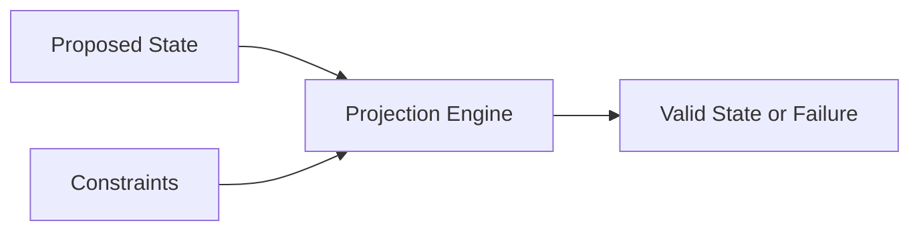

### FIG. 2 — DoF Extraction and Reconstruction

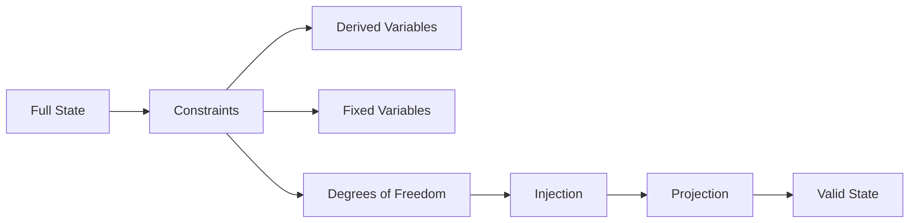

### FIG. 3 — Epoch-Based Projection

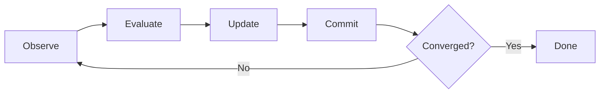

### FIG. 4 — Hardware Constraint Fabric

### FIG. 5 — CPAC Pipeline

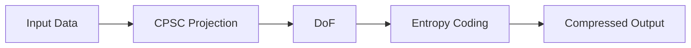

### FIG. 6 — Recursion-Stability Validation

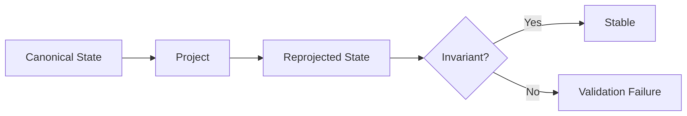

### FIG. 7 — AI Governance Layer

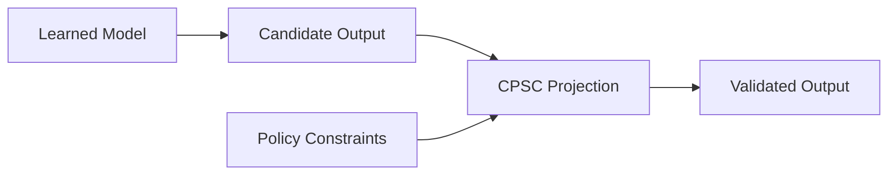

### FIG. 8 — Hardware Realm Governance

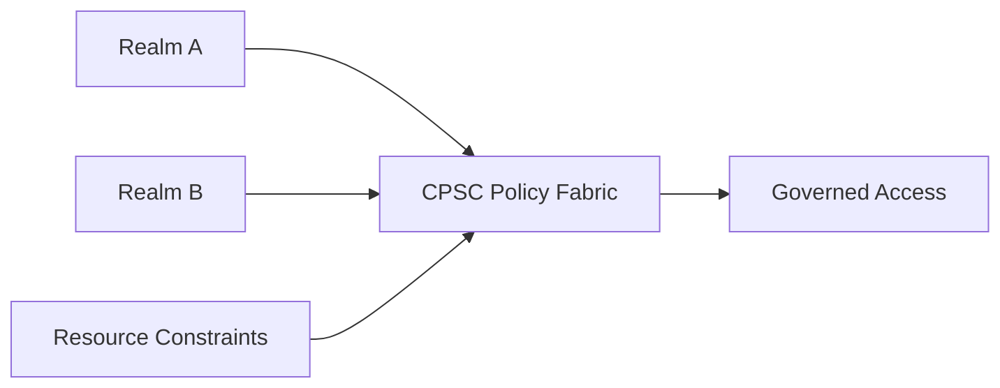

### FIG. 9 — Semantic System Specification Layer and Execution Backends

### FIG. 10 — Constraint-Projected Post-Quantum Verification Pipeline

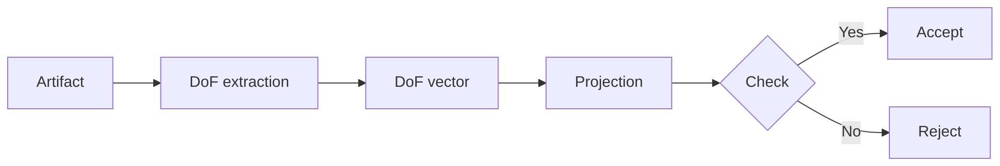

### FIG. 11 — Cryptographic State Manifold for Post-Quantum Signature

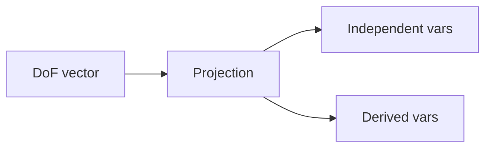

### FIG. 12 — Hardware Constraint Fabric for Post-Quantum Verification

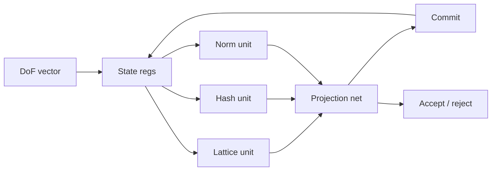

### FIG. 13 — CGAD Canonical Governance Pipeline

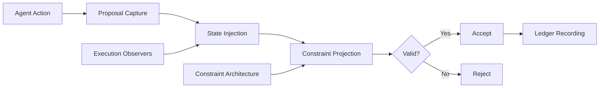
