# PROVISIONAL PATENT APPLICATION

CONSTRAINT-PROJECTED STATE COMPUTING SYSTEMS, SEMANTIC SYSTEM SPECIFICATION, AND APPLICATIONS

Inventor: Tristen Kyle Pierson

Applicant/Assignee: Tristen Kyle Pierson

Filing Date: TBD

---

### 1. TITLE

Constraint-Projected State Computing Systems, Semantic System Specification, and Applications

---

### 2. TECHNICAL FIELD

The present disclosure relates to computing systems and architectures. More particularly, the disclosure relates to deterministic computation performed by projecting system state into a space defined by explicit constraints, rather than by executing ordered instructions.

The disclosure further relates to methods for designing, specifying, and implementing such systems using a semantic system specification layer that expresses system intent, state roles, and invariant relationships independently of execution mechanics, and which is lowered into explicit constraint architectures suitable for execution by constraint-projected state computing engines.

The disclosed systems apply to both software and hardware implementations and support applications including, but not limited to, optimization, policy enforcement, scheduling, planning, configuration management, control systems, embedded sensing, security enforcement, real-time governance, artificial intelligence safety, mission-critical computing, and data compression.

---

### 3. BACKGROUND

Most contemporary computing systems are instruction-driven. Program execution is defined by ordered instruction streams, branching control flow, mutable execution state, and implicit runtime semantics. While effective for general-purpose computation, instruction-based systems are often ill-suited for domains governed primarily by rules, invariants, safety envelopes, policies, structural relationships, and correctness conditions.

Alternative approaches such as heuristic solvers, adaptive controllers, and machine-learned models frequently rely on probabilistic behavior, tuning, training, or stochastic execution. These approaches may lack deterministic replay, explicit failure modes, bounded convergence, or suitability for safety certification, particularly in embedded, real-time, or hardware-constrained environments.

Constraint programming systems and satisfiability solvers encode constraints declaratively, but typically operate as external solvers invoked episodically. Such systems do not define a unified execution model for system-wide state evolution, deterministic commit semantics, or continuous enforcement across software and hardware boundaries.

Optimization and numerical methods treat computation as convergence toward minima or fixed points of cost functions. These methods often rely on floating-point arithmetic, heuristic convergence criteria, or tolerance thresholds, and may not guarantee identical results across platforms, runs, or implementations.

Learned and adaptive systems, including neural networks and reinforcement learning systems, derive behavior from trained parameters rather than explicit constraints. Such systems may exhibit nondeterministic behavior, training drift, or opaque failure modes, and are difficult to certify for safety-critical or mission-critical applications.

In addition, existing system design practices frequently separate requirements documentation, implementation code, and validation logic, leading to semantic gaps between intended behavior and executed behavior. Correctness is often implicit, emergent, or distributed across code paths rather than explicitly declared.

Certain emerging computing paradigms, including quantum computing, further illustrate this gap. Existing quantum programming approaches typically describe low-level gate sequences, algorithm families, or Hamiltonian energy functions, and do not provide a stable, declarative layer for specifying what must be true of acceptable solutions, what constraints define correctness, or what invariants must hold across different hardware generations and algorithmic realizations. As a result, semantic intent is often entangled with execution methods and hardware details, complicating audit, governance, and long-term reuse.

In parallel, modern cryptographic systems rely heavily on public-key cryptography for authentication, integrity, and confidentiality. Anticipated advances in quantum computing have motivated the development and standardization of post-quantum cryptographic (PQC) algorithms, including module-lattice-based digital signatures (ML-DSA, formerly CRYSTALS-Dilithium), stateless hash-based signatures (SLH-DSA, formerly SPHINCS+), and module-lattice-based key-encapsulation mechanisms (ML-KEM, formerly CRYSTALS-Kyber). These algorithms are designed to resist quantum adversaries but impose significantly higher computational, memory, and bandwidth costs than many classical public-key schemes.

Conventional PQC implementations perform signing, verification, and key-establishment procedurally, executing ordered sequences of arithmetic, hashing, and structural reconstruction steps. Verification logic may repeatedly reconstruct large lattice objects, Merkle trees, or other intermediate cryptographic structures that are fully determined by public parameters, public keys, and received artifacts. This leads to excessive recomputation of derived structure, large signatures and verification artifacts, high verification latency and energy consumption, and poor suitability for constrained or embedded devices. Complex control-flow logic also complicates formal analysis and consistent hardware acceleration.

None of these paradigms provide a unified model in which system behavior—including cryptographic correctness—is specified declaratively in terms of semantic intent and invariants, and in which computation itself is defined as deterministic projection of system state into an explicitly constrained state space.

---

### 4. SUMMARY OF THE INVENTION

Constraint-Projected State Computing (CPSC) defines computation as a state-space operation rather than an instruction-execution process, establishing a paradigm in which correctness, determinism, and system behavior derive from explicit constraints and projection semantics rather than control flow or learned parameters.

In CPSC, a system is described by:

1. A finite set of state variables, and
2. A set of declarative constraints defining valid configurations of that state.

Computation consists of applying a deterministic projection process that resolves a proposed or initial state into a valid state satisfying the constraints, or deterministically reports failure when convergence cannot be achieved within declared bounds. Intermediate states are not semantically meaningful; only the final projected state has meaning.

In certain embodiments, the disclosed systems further include a semantic system specification layer used at design time to describe what a system does independently of execution mechanics. The semantic system specification identifies conceptual state elements, assigns roles indicating whether such elements are externally supplied, freely chosen, derived, or invariant, and declares invariant relationships that must hold among such elements.

The semantic system specification does not define instruction order, algorithms, solvers, or runtime behavior. Instead, it serves as a declarative description of system intent and correctness conditions. The semantic system specification is deterministically lowered into an explicit constraint architecture comprising concrete state variables, constraint expressions, and degrees of freedom suitable for execution by a CPSC engine. Lowering may be automated, semi-automated, or guided by configuration or policy.

In certain embodiments, CPSC identifies a minimal set of degrees of freedom representing independent variables sufficient to reconstruct a valid state. Fixed and derived variables need not be explicitly encoded or transmitted, enabling structural redundancy elimination, deterministic reconstruction, and efficient hardware mapping.

CPSC admits both software and hardware embodiments. In hardware embodiments, CPSC may be realized as a deterministic constraint fabric operating without instruction execution, program counters, or runtime interpretation. State updates occur only at declared commit boundaries, enabling deterministic replay, bounded execution, and suitability for safety-critical systems.

In one class of embodiments, CPSC is applied to cryptographic systems, including post-quantum cryptographic (PQC) signing, verification, and key-establishment. Cryptographic correctness conditions—such as lattice relations, norm bounds, hash-based consistency checks, and key-encapsulation validity conditions—are expressed as explicit constraints over a cryptographic state. Cryptographic artifacts are represented as degree-of-freedom vectors comprising only entropy-bearing variables, while expanded lattices, hash trees, intermediate algebraic values, and other derived structures are reconstructed deterministically through projection. This arrangement preserves the security properties of standardized PQC algorithms while reducing recomputation, transmitted artifact size, latency, and energy consumption and simplifying verification logic for both software and hardware implementations.

The disclosure further describes Constraint-Projected Adaptive Compression (CPAC), an application of CPSC in which structural redundancy is eliminated via constraint projection and degree-of-freedom extraction prior to optional prediction and conventional entropy coding. In such embodiments, projection and degree-of-freedom extraction occur first; any predictive components (including machine-learned or non-learned predictors) operate only over sequences of degrees of freedom, and entropy coding operates last over residual and/or degree-of-freedom streams.

Additional embodiments include deterministic optimization and satisfiability, real-time control, autonomous systems safety layers, hardware-based resource and security governance, artificial intelligence policy enforcement, configuration and planning systems, scheduling, validated telemetry and replay, and embedded low-power systems.

In some embodiments, the semantic system specification and corresponding constraint architectures define a stable, execution-independent intent layer for heterogeneous backends, including but not limited to classical processors, quantum computing systems, neuromorphic or analog accelerators, and learned or data-driven models such as neural networks, reinforcement learning agents, and large language models. In such embodiments, correctness conditions, invariants, and acceptable outcomes are defined declaratively at the semantic specification level, and one or more execution backends are selected, combined, or replaced over time without changing the specification.

The disclosed embodiments are illustrative and non-limiting.

---

### 5. BRIEF DESCRIPTION OF THE DRAWINGS

FIG. 1 — High-level CPSC computation model

FIG. 2 — Degrees-of-freedom extraction and reconstruction

FIG. 3 — Deterministic epoch-based projection schedule

FIG. 4 — Hardware constraint fabric architecture

FIG. 5 — CPAC compression and decompression pipeline

FIG. 6 — Recursion-stability validation (validation-time only)

FIG. 7 — AI or learned-system governance using CPSC

FIG. 8 — Hardware-based resource and security governance

FIG. 9 — Semantic system specification and lowering pipeline

FIG. 10 — Constraint-projected post-quantum verification pipeline (artifact as degree-of-freedom vector over cryptographic state, projection to a valid state or failure)

FIG. 11 — Cryptographic state manifold with independent (degree-of-freedom) and derived variables for a representative post-quantum digital signature

FIG. 12 — Hardware constraint fabric specialized for post-quantum verification, showing state registers, constraint evaluation units, and commit logic executing verification without an instruction stream

---

### 6. DEFINITIONS (NON-LIMITING)

State: A collection of variables representing a system configuration.
Constraint: A declarative, side-effect-free rule defining a required relationship among variables.
Valid State: A state satisfying all applicable constraints.
Projection: A deterministic process mapping a proposed state to a valid state or to failure.
Degree of Freedom (DoF): An independent variable required to reconstruct a valid state.
Epoch: A discrete execution phase at which state updates are atomically committed.
Semantic System Specification (SSS): A design-time representation describing system intent, state roles, and invariant relationships independently of execution mechanics. In some embodiments, an SSS is expressed in a structured, human-readable text format, such as a YAML-based encoding sometimes referred to as "Semantic-YAML," although the particular syntax is not limiting.
Canonical Valid State: A deterministic representative valid state used for validation.

---

### 7. CONSTRAINT-PROJECTED STATE COMPUTING MODEL

#### 7.1 State Model

A CPSC system operates on a finite set of state variables. Each variable has a defined type, domain, and optional metadata. Variables may represent logical assignments, numeric quantities, actuator commands, protocol fields, configuration values, resource allocations, or data-derived values.

#### 7.2 Constraint Model

Constraints are declarative rules over one or more variables. Constraints are side-effect free, do not prescribe evaluation order, may overlap in scope, and define validity or objective structure. Constraints may be hard or weighted.

#### 7.3 Projection Operation

Given a proposed state, a projection operator deterministically resolves the state into a valid configuration satisfying the constraints or reports failure under declared bounds. Projection may be iterative, staged, or bounded, provided determinism is preserved.

#### 7.4 Determinism and Convergence

Determinism is enforced through explicit numeric modes and precision, bounded update magnitudes, fixed iteration or epoch limits, deterministic tie-breaking rules, and commit-only state updates. Identical inputs and configuration yield identical outputs or identical failure indications.

#### 7.5 Epoch-Based Execution

In some embodiments, projection is structured into epochs comprising state observation, constraint evaluation, candidate update computation, and atomic commit. No state changes occur outside commit boundaries.

#### 7.6 Degrees of Freedom

Variables may be classified as fixed, derived, or free. Degrees-of-freedom extraction yields a minimal independent representation sufficient to reconstruct a valid state via projection.

#### 7.7 Recursion-Stability (Validation Only)

In some embodiments, CPSC supports an optional validation-time property referred to as recursion-stability. For a deterministic projection function P and a canonical valid state S, recursion-stability may require that P(S) equals S and that degrees of freedom remain invariant. This property is evaluated only during validation or certification and does not alter runtime semantics unless required by deployment.

#### 7.8 Distinction from Solvers and Preprocessors

CPSC is not limited to a solver, preprocessor, filter, or auxiliary analysis step. Projection defines the primary computational mechanism by which system state is evolved, validated, reconstructed, or enforced across software and hardware systems.

---

### 8. SEMANTIC SYSTEM SPECIFICATION AND LOWERING

#### 8.1 Semantic System Specification

In certain embodiments, systems are first described using a semantic system specification that expresses system behavior and correctness in terms of conceptual state elements, roles, and invariant relationships. The semantic system specification is independent of execution order, algorithms, solvers, numeric precision, or hardware details.

Each conceptual state element may be assigned a role indicating whether it is externally supplied, freely chosen, derived, or invariant. Relationships describe conditions that must always hold among state elements for the system to be correct.

#### 8.2 Lowering to Constraint Architecture

The semantic system specification is deterministically lowered into an explicit constraint architecture. Lowering may include expanding conceptual elements into concrete variables, translating relationships into algebraic or logical constraints, and identifying degrees of freedom based on assigned roles. The result is a constraint model suitable for execution by a CPSC engine.

Lowering may be automated, semi-automated, or guided by configuration rules. Multiple constraint architectures may be derived from the same semantic system specification for different deployment contexts.

#### 8.3 Advantages

This separation enables systems to be designed, reviewed, audited, and explained in semantic terms while retaining deterministic, constraint-based execution. It reduces semantic gaps between intent and implementation and enables formal validation, replay, and certification.

#### 8.4 Backend-Agnostic Execution and Non-Von-Neumann Systems

In some embodiments, the semantic system specification and resulting constraint architecture are used to drive execution on heterogeneous and non-von-neumann computing systems. For example, a single semantic system specification may be lowered into:

1. A classical constraint-architected model executed by a deterministic CPSC engine or equivalent constraint-projected executor;
2. A quantum circuit or Hamiltonian encoding suitable for execution on a gate-based or annealing-style quantum processor;
3. A neuromorphic or analog computing fabric configured to evolve state according to equivalent constraints; or
4. A learned or data-driven model, such as a neural network or reinforcement learning agent, that proposes candidate states subject to the same constraint architecture.

In these embodiments, the semantic system specification and constraint architecture define correctness conditions and acceptable outcomes independently of the particular execution backend. Quantum, neuromorphic, analog, or learned systems are treated as interchangeable or complementary execution mechanisms operating under a common, constraint-defined semantics.

In a neuromorphic embodiment, state variables may correspond to membrane potentials, synaptic weights, spike counts, or other quantities associated with artificial neurons and synapses. Constraints encode desired steady-state patterns, firing relationships, conservation properties, admissible trajectories, or other invariants that characterize valid network behavior. Projection is realized by configuring network parameters and input drives such that the physical or simulated spiking dynamics converge toward a state that satisfies the declared constraints. Commits are taken at sampling boundaries, for example when the network has settled into a stable spike pattern or rate profile within declared tolerances, and that sampled configuration is treated as the canonical valid state.

In an analog or in-memory compute embodiment, state variables may correspond to voltages, currents, charges, or stored conductance values in resistive, capacitive, or memristive elements. Constraints encode admissible transfer relationships, balance conditions, region-of-operation limits, or other circuit-level invariants. Projection is effected by injecting degrees of freedom as controlled stimuli, boundary conditions, or initial states and allowing the analog network to evolve toward a stable configuration consistent with the constraints. Commits are taken when the network settles within declared error bounds, at which point the measured analog quantities are interpreted as the projected valid state. In all such embodiments, the semantic system specification continues to define the intended variables, constraints, and acceptable outcomes independently of the underlying hardware, and non-von-neumann backends are treated as physical realizations of the same constraint architecture rather than as separate sources of semantic intent.

---

### 9. HARDWARE EMBODIMENTS

In hardware embodiments, CPSC may be implemented as a deterministic constraint fabric comprising state registers, parallel constraint evaluation units, projection or update networks, commit logic, and convergence detection. Such systems do not execute instructions, do not require program counters, and do not interpret data as code at runtime. Implementations may be realized in FPGA or ASIC. In some embodiments, the constraint fabric is specialized for cryptographic workloads, including deterministic verification of post-quantum digital signatures and key-encapsulation mechanisms under a constraint-architected cryptographic state model.

#### 9.1 Proto-cell fabric and epoch controller embodiment (non-limiting)

In certain embodiments, the constraint fabric is realized as a **proto-cell fabric** governed by a global **epoch controller**. This realization is one preferred, multi-purpose embodiment of a CPSC hardware fabric and is not limiting.

In such embodiments, the global CPSC state is represented as the aggregate of local state associated with a plurality of proto-cells. Each proto-cell maintains:

- local configuration parameters (for example, constraint coefficients, neighborhood weights, and enable flags);
- one or more local state registers subject to constraint projection; and
- explicit neighbor interfaces defining which adjacent proto-cells or routing nodes it exchanges signals with.

Proto-cells are atomic compute and structure units. They do not execute instructions, do not interpret code, and do not branch on control flow; instead, their behavior is defined entirely by static hardware logic and local configuration and state.

A shared epoch controller orchestrates deterministic, globally synchronized epochs. Each epoch is divided into phases such as:

1. **Sense**, in which proto-cells sample their own state and the exposed state or signals of their neighbors without changing any committed state;
2. **Compute**, in which proto-cells evaluate fixed local update functions that apply projected constraints to the sampled values;
3. **Evaluate**, in which local quality or fitness signals are computed and, in some embodiments, aggregated; and
4. **Commit**, in which the epoch controller authorizes simultaneous or deterministically ordered updates to proto-cell state registers for the next epoch.

No committed state changes occur outside the commit phase. Given a fixed initial state and configuration, and a fixed epoch schedule, the sequence of states produced by the proto-cell fabric is therefore deterministic and replayable. This satisfies CPSC determinism requirements while providing a concrete, instruction-free realization of epoch-based projection.

The fabric topology (for example, one-dimensional chains, two-dimensional meshes, tori, trees, or more general graphs) and the number of proto-cells are design choices. These topologies are preferably selected to efficiently embed classes of constraint problems, such as satisfiability, graph, or scheduling benchmarks, but no particular topology is required by the CPSC model.

In preferred FPGA or ASIC realizations, the proto-cell fabric and epoch controller are defined by a **single static bitstream or fixed hardware image**. All problem-specific variation is expressed as data written into proto-cell configuration memories and state registers, not as changes to the bitstream or hardware image. A single hardware configuration can therefore be reused across many constraint problems by changing only the configuration and initial state data.

#### 9.2 CAS-style constraint input, CPSC Binary, and hardware configuration path

In further embodiments, the proto-cell fabric and epoch controller are configured using a deterministic binary representation referred to as a **CPSC Binary** format. CPSC Binary compactly encodes, in a streamable form:

- a declarative constraint specification (for example, a CAS- or CAS-YAML-style model describing variables, constraints, degrees of freedom, and execution parameters);
- a mapping from abstract variables and constraints in that model onto specific proto-cells, neighbor links, and configuration fields in the fabric; and
- optional initial state assignments and control parameters for the epoch controller.

A compilation toolchain executing on a programmable processor or host system parses the declarative constraint model, allocates proto-cell resources, computes routing and neighbor relationships, and emits a canonical CPSC Binary blob. The CPSC Binary blob is then consumed by a deterministic hardware or microcoded decoder coupled to the proto-cell fabric. In one embodiment, the decoder receives CPSC Binary as a byte stream via a direct memory access (DMA) engine or equivalent transport and:

1. parses header and model metadata fields that bind the blob to a specific CPSC constraint model;
2. decodes configuration records that assign per-proto-cell parameters, neighbor tables, and initial state values; and
3. issues a deterministic sequence of writes to configuration memories and state registers in the proto-cell fabric and to control registers in the epoch controller.

The decoder’s behavior is defined such that any conforming implementation, given the same CPSC Binary input, will configure the proto-cell fabric into the same initial CPSC state, regardless of physical routing or implementation details. Together, the declarative constraint model, the deterministic compilation to CPSC Binary, and the deterministic decode and application of CPSC Binary to the proto-cell fabric form a complete, deterministic path from abstract constraints to executable CPSC hardware state.

Alternative embodiments may employ different declarative syntaxes, binary layouts, transports, or decoders while remaining within the scope of the invention, provided that they:

- represent constraints, degrees of freedom, mappings, and initial state in a deterministic binary form; and
- apply that binary form deterministically to a hardware fabric that satisfies the CPSC constraint-projected state semantics.

#### 9.3 Realm-based execution environments (optional)

In some embodiments, the proto-cell fabric and epoch controller are integrated into a **realm-based execution environment** that partitions access to the fabric, host processors, and other accelerators into deterministic realms. Each realm is associated with an auditable allocation of time, bandwidth, and, optionally, an energy or power envelope. A realm scheduler assigns exclusive temporal slices of epoch execution to each realm and records per-realm metrics such as epoch counts, configuration identifiers, and summaries of projected states or objective values.

These realm features provide additional guarantees about isolation, replay, and governance for fabric usage. They are optional and may be claimed in dependent claims or separate embodiments; the core CPSC model and proto-cell fabric with epoch controller do not require realms to function.

---

### 10. SOFTWARE AND HYBRID EMBODIMENTS

Software embodiments implement equivalent semantics using deterministic projection engines. Hybrid embodiments combine software-managed semantic specifications with hardware constraint fabrics that perform projection and enforcement. In some embodiments, software projection engines implement constraint-projected verification of post-quantum cryptographic artifacts, including lattice-based and hash-based signatures and key-encapsulation mechanisms, on general-purpose processors.

---

### 11. APPLICATION EMBODIMENTS (NON-EXHAUSTIVE)

This section provides a non-exhaustive catalog of application embodiments for
CPSC, CPAC, and CGAD. For a continuously updated, public-facing index of
embodiments (including identifiers and one-sentence summaries), see also
`docs/public/cpsc-embodiments-overview.md` in the `.github` repository. That
overview document is informational and does not alter the scope of this
specification or any associated claims.

#### 11.1 Constraint Optimization and Satisfiability

Constraints encode satisfiability or optimization problems. Projection evolves assignments toward satisfaction or reduced cost deterministically. Weighted constraints may express preferences or objectives.

#### 11.2 Configuration, Planning, and Scheduling

Systems generate configurations, plans, or schedules that satisfy hard constraints and optional preferences. Degrees of freedom represent choices, while derived variables are reconstructed via projection.

#### 11.3 Policy and Authorization Enforcement

Access decisions are derived from requests, policies, and resource state. Projection ensures all policy rules are satisfied or deterministically denies access.

#### 11.4 Real-Time Control and Safety Envelopes

Actuator commands are projected into constraint-defined safety envelopes, ensuring valid outputs without heuristic tuning.

#### 11.5 Autonomous and Robotic Systems

Candidate actions proposed by learned or heuristic systems are projected into constraint-defined spaces encoding safety, dynamics, and policy rules.

#### 11.6 AI and Learned-System Governance

Outputs from neural networks or language models are projected into constraint-defined state spaces encoding policy, safety, or structural rules. CPSC enforces correctness without interpreting semantic content.

In some embodiments, the same semantic system specification that defines policy, safety, or structural rules is also used to define observation, action, and state spaces for learned systems such as neural networks, reinforcement learning agents, or large language models. The semantic system specification and constraint architecture define which variables are externally supplied, which variables are freely chosen or proposed by a learned model, and which invariants must hold regardless of model parameters or training.

In these embodiments, learned systems act as proposal mechanisms for degrees of freedom or candidate states, and a CPSC engine or equivalent constraint-architected executor performs deterministic projection into the constraint-defined space. This arrangement decouples semantic correctness and policy enforcement from any particular neural architecture, training procedure, or deployment platform, and allows multiple learned models, classical solvers, or specialized hardware accelerators to share the same constraint-defined semantics. In some embodiments, these governance arrangements are further specialized for agentic development environments as described in Section 13 (CPSC-Governed Agentic Development).

#### 11.7 Hardware-Based Resource and Security Governance

Constraints encode scheduling, power, memory, and access rules enforced directly in hardware.

#### 11.8 Telemetry, Logging, and Replay

Telemetry is validated, reconstructed, and replayed deterministically using projection, enabling corruption detection and forensic analysis.

#### 11.9 Embedded and Low-Power Systems

CPSC enables deterministic, explainable computation without reliance on neural inference, reducing energy consumption.

#### 11.10 Constraint-Projected Adaptive Compression

In Constraint-Projected Adaptive Compression (CPAC), compression proceeds in three conceptual stages. First, CPSC or an equivalent constraint-architected system ingests raw input (for example, bytes, logs, telemetry frames, or token streams), maps this input into a constraint-architected state, and applies deterministic projection to obtain a minimal degree-of-freedom (DoF) representation. Structural constraints are enforced at this stage, and implied or derivable fields are removed.

Second, an optional predictor operates only over the degree-of-freedom representation (for example, per block or across blocks), producing predicted degrees of freedom. The encoder then forms residuals between actual and predicted degrees of freedom.

Third, an entropy encoder processes the residual stream and, in some embodiments, portions of the degree-of-freedom stream, to produce a compressed bitstream.

On decode, the pipeline is applied in reverse order. An entropy decoder reconstructs predicted degrees of freedom and residuals, which are combined to reconstruct the actual degree-of-freedom representation. This reconstructed degree-of-freedom representation is then injected into a CPSC projection engine to reconstruct a full valid state. Predictive components do not operate directly on raw input bytes; they operate only on the structured degree-of-freedom sequences produced by the projection stage.

#### 11.11 Quantum and Non-Von-Neumann Execution Backends

In some embodiments, the disclosed semantic system specification and constraint-architected execution model are applied to quantum computing systems and other non-von-neumann architectures.

In one embodiment, a system designer specifies variables, constraints, degrees of freedom, and acceptable outcomes for a problem domain using a semantic system specification. The specification is lowered into a constraint architecture that is independent of any particular quantum gate set, qubit topology, Hamiltonian encoding, or quantum algorithm family. The same constraint architecture may then be compiled into one or more quantum realizations, such as a quantum circuit or an energy function suitable for annealing or variational algorithms, while preserving the declared constraints and acceptable outcomes.

In such embodiments, quantum hardware is treated as a probabilistic execution backend for the constraint architecture rather than as the location of semantic intent. Correctness conditions, invariants, and acceptable solution sets are defined declaratively in the semantic system specification and constraint architecture, and quantum programs or Hamiltonians are generated as one of several possible execution realizations.

In another embodiment, the same semantic system specification is used to target both quantum and classical backends. Classical solvers, heuristic optimizers, or deterministic CPSC engines may be applied to the constraint architecture alongside or in place of quantum execution. This enables hybrid classical–quantum systems in which different backends are selected or combined without changing the semantic specification of the problem.

In further embodiments, analogous techniques are applied to neuromorphic processors, analog computing systems, in-memory compute fabrics, or other non-von-neumann architectures. These backends may realize the constraint architecture using spiking dynamics, continuous-time evolution, or other non-instructional mechanisms, while the semantic system specification continues to define the intended variables, constraints, and acceptable outcomes independently of the underlying hardware.

#### 11.12 Learned Predictor Embodiments for Constraint-Projected Adaptive Compression

In some embodiments, Constraint-Projected Adaptive Compression employs a learned prediction stage operating in the semantic degree-of-freedom space defined by a semantic system specification and corresponding constraint architecture. In these embodiments, raw input is first mapped into a constraint-architected state and projected by a CPSC engine into a minimal DoF representation as described above. The learned prediction stage operates only on sequences of such degrees of freedom, which are by construction consistent with the underlying constraints, and produces predicted degrees of freedom and, in some embodiments, probability distributions or auxiliary features. A residual or distribution-based representation derived from the predictor output is then provided to the entropy coding stage.

##### 11.12.1 Predictor Deployment and Metadata

In further embodiments, trained model parameters are quantized or otherwise adapted for deployment. For example, weights and biases may be quantized to fixed-point representations, such as 8-bit or 16-bit integers, and packed into a compact deployment format. Deployed models may be embedded directly in a compressed bitstream header, stored in a sidecar model file referenced by a model identifier carried in the bitstream, or obtained from a shared library or model registry addressable by such identifiers. In some embodiments, each compressed stream carries identifiers for both the constraint architecture or semantic system specification used to generate the degrees of freedom and the predictor model used to generate predictions, enabling decoders to select or load the correct combination.

In some embodiments, the interaction between the learned prediction stage and the entropy coding stage admits multiple variants. In a residual-based embodiment, the predictor outputs predicted degrees of freedom, residuals are formed between actual and predicted degrees of freedom, and the residual stream, optionally together with side information, is entropy coded. In a distribution-based embodiment, the predictor outputs a probability distribution or other parametric description over possible DoF values, and an entropy coder such as arithmetic or asymmetric numeral systems coding uses these distributions directly as coding models. In hybrid embodiments, outputs of the learned predictor are used to select among multiple entropy coding models, quantization granularities, or block partitioning strategies.

In additional embodiments, multiple predictor families are defined and used selectively. For example, different learned predictors may be trained for different data domains, such as source code, logs, or metrics, each paired with a corresponding semantic system specification or constraint architecture. Different performance profiles may also be provided, such as a low-complexity predictor for real-time or low-power operation and a higher-capacity predictor for maximum compression efficiency. In some embodiments, a mixture-of-experts arrangement is used in which, for each block or region, a selector chooses among a small set of predictor models based on local features or prior performance, and the selected model identity is recorded in a low-rate side stream that is decoded alongside the residual or distribution information.

In these embodiments, learning and prediction occur in the structured DoF space defined by constraints and the semantic system specification, rather than directly over raw bytes or unconstrained token streams. The overall CPAC pipeline therefore composes three separable and updatable elements: a constraint-architected projection stage that defines the semantic DoF space, a learned prediction stage operating within that space, and an entropy coding stage that encodes residual or distributional information. Multiple combinations of constraint architectures and learned predictors may be supported, with each compressed stream identifying the particular constraint model and predictor model used, while the underlying constraint-projected execution semantics remain unchanged.

#### 11.13 Constraint-Projected Execution of Post-Quantum Cryptographic Algorithms

In certain embodiments, Constraint-Projected State Computing is applied to execution of post-quantum cryptographic (PQC) algorithms. In these embodiments, cryptographic operations are expressed as declarative constraints over an explicit cryptographic state, and cryptographic validity is determined by projection of that state into a constraint-satisfying configuration, rather than by executing ordered instruction sequences.

Post-quantum cryptographic algorithms, including lattice-based key-encapsulation mechanisms, lattice-based digital signature schemes, and hash-based constructions, are typically defined by precise algebraic relations, domain bounds, and validity conditions. Conventional implementations enforce these properties procedurally through instruction-driven control flow, branching logic, and conditional rejection steps. Such implementations may be difficult to formally verify, susceptible to side-channel leakage, and challenging to map consistently across software and hardware environments.

##### 11.13.1 Cryptographic State and Constraint Model

In the disclosed embodiments, a cryptographic algorithm is represented as a constrained state space. State variables correspond to cryptographic objects such as polynomial coefficients, vectors, matrices, seeds, challenges, message digests, Merkle tree nodes, ciphertext components, and intermediate values. Each variable has a defined type, domain, and derivation status.

Variables are classified as:

* independent variables (degrees of freedom), which carry entropy and must be provided or transmitted;
* derived variables, which are fully determined by constraints; and
* fixed variables, which are invariant or defined by the cryptographic model or deployment configuration.

Cryptographic rules—including ring arithmetic relations, modular reduction, norm bounds, matrix–vector products, hash-based consistency checks, Merkle path conditions, and encapsulation/decapsulation relations—are expressed as declarative constraints over these variables. Constraint evaluation order is not semantically significant, and intermediate computational states are not externally observable.

Verification proceeds by injecting values for the degrees of freedom into a partial cryptographic state and deterministically projecting the state until all constraints are satisfied or a failure condition is detected. Cryptographic verification therefore corresponds to convergence of the projection process, while cryptographic failure corresponds to non-convergence or violation of constraints. There is no explicit procedural verification logic, branching on secret data, or instruction-level control flow determining validity.

In some embodiments, determinism and side-channel resistance are improved by enforcing that, for a given cryptographic input and configuration, projection converges to the same valid state or fails in the same manner across executions. Numeric precision, arithmetic modes, and convergence criteria are explicitly declared. Randomized control flow and data-dependent branching are eliminated. Because cryptographic validity is determined through constraint satisfaction rather than conditional execution paths, the system may reduce side-channel leakage arising from timing, branching, or microarchitectural effects.

In some embodiments, only the minimal independent cryptographic information required to define a valid state is injected into the system. Derived values, such as public key components, intermediate products, or verification artifacts, are reconstructed through projection and need not be stored or transmitted. This minimizes exposure of sensitive material and reduces persistent storage of derived cryptographic state. Cryptographic state may be serialized or reconstructed using a deterministic binary interchange format that encodes degrees of freedom and model identity, allowing secure reconstruction of full cryptographic state only when required.

The constraint-projected cryptographic execution architecture may be implemented in software, hardware, or hybrid systems. In software embodiments, constraint projection may be implemented using deterministic numeric solvers operating over fixed or bounded-precision arithmetic. In hardware embodiments, the system maps naturally to a constraint evaluation fabric comprising parallel constraint units, state registers, and convergence detection logic, without instruction decoding or program counters. This uniform model enables consistent cryptographic behavior across CPUs, embedded systems, FPGAs, and ASICs, reducing discrepancies between reference software implementations and deployed hardware accelerators.

These cryptographic embodiments operate in conjunction with the core CPSC model and CPAC embodiments. They do not alter cryptographic primitives, security assumptions, or standardized algorithm definitions, but instead extend the execution architecture to support deterministic enforcement, efficient state handling, and formal governance of post-quantum cryptographic systems.

##### 11.13.2 NIST-Selected Algorithm Embodiments

In some embodiments, the disclosed systems are applied to standardized post-quantum cryptographic algorithms selected by NIST, including but not limited to ML-DSA (formerly CRYSTALS-Dilithium), SLH-DSA (formerly SPHINCS+), and ML-KEM (formerly CRYSTALS-Kyber). In all such embodiments, the underlying cryptographic algorithms and security assumptions are preserved; CPSC is used only as an execution and verification architecture.

###### 11.13.2.1 ML-DSA (Dilithium) Verification

For ML-DSA verification, the cryptographic state may include variables representing, without limitation:

* public-key entropy components;
* signature entropy components;
* message hash values;
* derived polynomial vectors and matrices;
* derived challenge values; and
* validity indicators.

Algebraic relations specified by ML-DSA, including lattice relations, norm bounds, and challenge consistency conditions, are encoded as explicit constraints. Expanded matrices, polynomial products, and related intermediate values are treated as derived variables and reconstructed through constraint projection rather than procedural recomputation. Only entropy-bearing components, such as secret-dependent vectors and randomness, are transmitted or injected into the system state.

###### 11.13.2.2 SLH-DSA (SPHINCS+) Verification

For SLH-DSA verification, the cryptographic state may include variables representing, without limitation:

* message hash values;
* one-time signature entropy;
* Merkle tree path entropy;
* derived hash tree nodes and roots; and
* validity indicators.

Hash-based relations defined by SLH-DSA, including Merkle path correctness and root reconstruction, are encoded as constraints. Hash tree nodes and root values are treated as derived variables and reconstructed through constraint projection rather than procedural traversal. Only the entropy-bearing components of the signature and authentication path are transmitted or injected as degrees of freedom.

###### 11.13.2.3 ML-KEM (Kyber) Operations

For ML-KEM operations, the cryptographic state may include variables representing, without limitation:

* public-key entropy components;
* encapsulated key material;
* ciphertext entropy components;
* derived shared secrets;
* intermediate lattice products and reductions; and
* validity indicators.

Encapsulation and decapsulation relations defined by ML-KEM are enforced as constraints over the cryptographic state, with derived values reconstructed through projection. Degrees of freedom are limited to entropy-bearing inputs such as randomness and ciphertext components; deterministic relationships among public parameters, public keys, and derived shared secrets are handled as constraints.

##### 11.13.3 Compression-Coupled Cryptographic State Handling

In further embodiments, the constraint-projected cryptographic execution architecture is combined with Constraint-Projected Adaptive Compression to reduce the size, exposure, and transmission cost of cryptographic state while preserving exact reconstructability and cryptographic correctness. In such embodiments, cryptographic state is represented as a constrained state space in which a subset of variables constitute independent degrees of freedom and remaining variables are fully derived by cryptographic constraints. Prior to storage or transmission, only the degree-of-freedom values are serialized. Derived cryptographic values, including intermediate products, public parameters, or verification artifacts, are omitted and reconstructed deterministically by constraint projection during decompression or use.

Compression is performed by applying constraint-projected state computing to eliminate implied cryptographic structure, followed by optional prediction over the degree-of-freedom stream and entropy coding. This process does not compress encrypted payloads or secret material beyond what is structurally implied by the cryptographic model itself. Instead, it removes redundancy arising from deterministic relationships defined by the cryptographic algorithm. During decompression, the compressed degree-of-freedom representation is decoded, injected into the cryptographic constraint model, and projected to reconstruct a valid cryptographic state. If reconstruction fails to converge, the compressed representation is rejected as invalid or corrupted. Compression and decompression are exact inverses and preserve cryptographic correctness.

##### 11.13.4 Cryptographic Governance and Formal Verification

In additional embodiments, the constraint-projected cryptographic execution architecture is employed as a governance and formal-verification substrate for cryptographic systems. In these embodiments, cryptographic algorithms are specified declaratively as constraint models that explicitly enumerate state variables, algebraic relations, domain bounds, and validity conditions. These constraint models serve as authoritative, machine-readable specifications of cryptographic behavior, distinct from any particular software implementation.

Cryptographic implementations are validated by demonstrating that their execution corresponds to projection of the declared state model under the specified constraints. Correctness is defined as convergence to a valid state; incorrect or non-conformant behavior is defined as failure to converge or violation of constraints. This enables formal reasoning about cryptographic correctness without reliance on informal code inspection or procedural interpretation.

In some embodiments, constraint models are versioned, hashed, and bound to cryptographic artifacts, enabling verifiable traceability between deployed systems and their governing specifications. Changes to cryptographic parameters, arithmetic precision, or algorithm variants are expressed as explicit modifications to the constraint model, rather than implicit code changes. Third parties may independently reconstruct and validate cryptographic state using the same constraint model and degree-of-freedom inputs, without access to proprietary implementation details.

##### 11.13.5 Post-Quantum Communication and Key-Management Embodiments

In certain embodiments, the constraint-projected cryptographic execution architecture is applied to post-quantum communication channels, storage systems, and identity infrastructures. In these embodiments, the cryptographic state model is extended to cover:

* channel-level handshake and session state for data in transit, including hybrid classical-plus-PQC handshakes in which both classical and post-quantum artifacts are modeled as degrees of freedom over a shared constraint space;
* key hierarchies and wrapping relationships for data at rest, including master keys, data-encryption keys, and per-object keys anchored in PQC-rooted degrees of freedom; and
* identity, certificate, and policy state for users, services, and devices, including hybrid certificate chains carrying both classical and PQC material.

In such embodiments, FIG. 10 illustrates a non-limiting verification pipeline in which a post-quantum artifact, such as a signature or ciphertext produced by a standardized lattice- or hash-based scheme, is interpreted as a vector of degrees of freedom injected into a cryptographic state model and projected into a valid state or rejected. FIG. 11 illustrates a corresponding state manifold in which entropy-bearing variables and derived variables are explicitly separated. FIG. 12 illustrates a constraint fabric specialized for post-quantum verification, in which these same models are executed by hardware without an instruction stream.

These communication and key-management embodiments realize, in the post-quantum setting, the three conceptual layers described in the public-facing PQC overview: (1) data in transit, in which PQC or hybrid handshakes are modeled as constraint-projected transitions between endpoint states; (2) data at rest, in which stored artifacts and key hierarchies are represented by degrees of freedom over a constrained cryptographic state; and (3) identity and lifecycle, in which certificate authorities, code-signing keys, and attestation records are represented and governed within the same constraint-projected framework. Hybrid deployments in which both pre-quantum and post-quantum mechanisms coexist are captured by extending the cryptographic state model to include legacy and PQC variables together with constraints expressing migration and downgrade policies (see also Section 11.17).

#### 11.14 Optional Learned Structure-Induction Embodiment (Neural-Assisted CPSC)

In certain embodiments, the constraint-projected state computing (CPSC) system includes an optional learned structure-induction stage positioned prior to constraint projection. This stage employs one or more trained machine-learning models to propose structured representations, annotations, or candidate state assignments derived from input data. The learned models do not determine correctness or validity and do not replace constraint enforcement. Instead, they generate proposals that are subsequently validated, corrected, or rejected by CPSC projection.

The learned structure-induction stage may operate on arbitrary input data, including files, streams, or blocks of data, and may output proposed state variables, inferred relationships, predicted degrees of freedom, residual estimates, or auxiliary metadata. All outputs of the learned stage are treated as non-authoritative and are subject to deterministic constraint projection. Cryptographic correctness, compression correctness, and state validity are determined solely by convergence of the CPSC projection process.

##### 11.14.1 Unified and Multiple Model Configurations

The learned structure-induction stage may be implemented using a single trained model applicable across heterogeneous data domains or using multiple trained models specialized for different classes of structured state spaces. In some embodiments, a unified model is trained on diverse data types to induce general structural regularities applicable across formats. In other embodiments, separate models are trained for different structural classes, such as record-oriented data, framed streams, block-structured binaries, or text-like representations.

Model selection, composition, or sequencing may be performed dynamically based on input characteristics, configuration, or confidence measures. Incorrect or suboptimal model selection does not compromise correctness, as all proposed structure is validated by constraint projection. In some embodiments, multiple models are applied sequentially or hierarchically, with earlier models providing coarse structure proposals and later models refining those proposals prior to projection.

##### 11.14.2 Determinism and Optionality

The learned structure-induction stage is optional and may be bypassed entirely without affecting correctness. The CPSC system remains fully functional in the absence of learned proposals. When present, learned models are frozen, versioned, and executed deterministically for a given input and configuration. Projection behavior and output validity remain deterministic and reproducible regardless of the presence or absence of learned structure induction.

##### 11.14.3 Relationship to Compression and Cryptography

In compression embodiments, learned structure-induction may be used to propose structured latent representations that reduce the effective degrees of freedom prior to constraint-projected adaptive compression. In cryptographic embodiments, learned structure-induction may be used to propose candidate cryptographic state components or intermediate values, which are then validated by cryptographic constraints during projection. In all cases, learned models serve only as proposal mechanisms and do not alter cryptographic assumptions, security properties, or lossless reconstruction guarantees.

##### 11.14.4 Authority of Constraint Projection

In all embodiments, constraint projection is the sole authority on state validity. Learned models cannot override constraints, introduce new semantics, or cause acceptance of invalid state. Projection convergence defines success; projection failure defines rejection. This separation ensures that learned components may improve efficiency or compression effectiveness without compromising correctness, security, or determinism. In some embodiments targeting agentic development workflows, these guarantees are applied to conversations, prompts, and agent proposals as further detailed in Section 13 (CPSC-Governed Agentic Development).

##### 11.14.5 Structural-Class-Based Learned Model Taxonomy

In certain embodiments, one or more learned structure-induction models are organized and trained according to classes of constrained state structure rather than according to file types or explicit data formats. Each structural class is defined by the nature of dependencies, invariants, and reconstruction relationships present in the underlying state space, rather than by syntactic identifiers or external metadata. This classification enables learned models to generalize across heterogeneous data sources that share common structural properties while avoiding brittle reliance on format detection.

Structural classes may include, by way of example and not limitation: fixed-arity block-structured state spaces in which state variables are arranged in uniform blocks; record-oriented or delimited state spaces in which variable-length records are separated by boundaries or framing; header–payload or container-structured state spaces in which metadata constrains payload interpretation; temporally correlated or sequential state spaces in which state at one position constrains state at adjacent positions; algebraically constrained state spaces governed by explicit equations or validity relations; and opaque or high-entropy state spaces in which little exploitable structure is present. A single input may exhibit multiple structural classes simultaneously, and learned models may propose structure for one or more classes within the same input.

Learned structure-induction models may be trained to recognize and propose candidate structure associated with one or more of these structural classes, including boundary proposals, inferred dependencies, candidate derived variables, predicted degrees of freedom, or auxiliary annotations. In some embodiments, a single learned model is trained across multiple structural classes to induce general structural regularities. In other embodiments, multiple learned models are trained for different structural classes and may be applied selectively, sequentially, or hierarchically. Model selection or composition may be based on input characteristics, configuration, confidence estimates, or other heuristics, but incorrect or suboptimal selection does not affect correctness.

All structure proposed by learned models is treated as non-authoritative and is subject to validation by constraint-projected state computing. The constraint projection stage enforces declarative constraints defining valid state and determines whether a proposed structure is accepted, corrected, or rejected. Projection convergence defines successful interpretation of the proposed structure; projection failure defines invalid or unsupported structure. In some embodiments, learned models may explicitly abstain from proposing structure for inputs that appear structurally opaque or high-entropy, allowing the system to bypass learned induction and proceed directly to constraint projection without loss of correctness.

##### 11.14.6 Benchmarking and Evaluation

In certain embodiments, the effectiveness of learned structure-induction models organized by structural class is evaluated using Constraint-Projected Adaptive Compression benchmarking. Benchmarking is performed by comparing compression pipelines that include learned structure-induction stages against pipelines that omit such stages, while holding constant the constraint models, projection parameters, and entropy coding backends. Metrics may include compression ratio, reconstruction fidelity, encode and decode time, determinism, and projection convergence behavior.

Because learned structure-induction operates only as a proposal mechanism, benchmarking isolates its contribution by measuring changes in degree-of-freedom reduction, residual magnitude, or projection efficiency attributable to different structural-class models. This evaluation approach enables quantitative comparison of unified versus multiple learned models and of different structural classes without affecting correctness or lossless reconstruction guarantees.

##### 11.14.7 Negative-Case Handling and Graceful Degradation

In certain embodiments, the system explicitly supports negative cases in which learned structure-induction does not identify meaningful structure or proposes structure that is incompatible with the constraint model. In such cases, constraint projection may reject the proposed structure, correct it, or converge only on a trivial valid state corresponding to a high degree-of-freedom representation. The system may treat such inputs as structurally opaque and bypass learned structure-induction for subsequent processing.

This behavior ensures that performance degrades gracefully on incompressible, encrypted, already-compressed, or adversarial inputs, with compression ratios approaching those of baseline entropy coding and without introducing expansion beyond expected overhead. Correctness, determinism, and reconstruction fidelity are preserved regardless of learned model performance, and no learned component is permitted to cause acceptance of invalid state.

#### 11.15 Quantum Resource Governance and Scheduling

In some embodiments, Constraint-Projected State Computing is applied to governance and scheduling of heterogeneous computing resources including one or more quantum processors. In these embodiments, a resource governance fabric is modeled as a constrained state space in which variables represent realms, resource pools, workloads, policies, and scheduling decisions across classical and quantum backends.

Realms may include, for example, classical CPU clusters, GPU pools, one or more quantum processing units (QPUs), quantum simulators, and specialized accelerators. State variables describe realm capacities, queue depths, error budgets, access control attributes, tenancy and isolation labels, maintenance windows, and regulatory classifications. Additional variables represent workload descriptors such as required backend capabilities, latency and fidelity requirements, security posture, and tenancy constraints.

Constraints encode governance and scheduling rules. Examples include constraints that restrict particular workloads to specific realms (for example, requiring that certain safety-critical or regulated workloads may only target QPUs meeting declared calibration and error-rate thresholds), constraints that enforce isolation between tenant realms, constraints that bound aggregate error budgets or utilization metrics over time, and constraints that require that PQC-governed traffic use only realms configured with approved cryptographic stacks.

Given a proposed scheduling state—for example, proposed assignments of workloads to realms, start times, and resource slices—a projection engine enforces governance and resource constraints to determine a valid assignment. If a valid constrained state exists within the declared limits, projection converges to a scheduling configuration in which all workloads are assigned to compatible realms, error budgets and utilization bounds are respected, and isolation and policy rules are satisfied. If no such configuration exists, projection fails, and the proposed assignments are rejected or revised.

In some embodiments, this quantum resource governance fabric is implemented directly in hardware as a realm-governance CPSC fabric coupled to or embedded within datacenter infrastructure. Projection may execute at the boundary between realms, such that any attempt to allocate, migrate, or submit workloads to quantum or classical resources is first projected into a constraint-satisfying governance state before taking effect. In other embodiments, the same constraint architecture is executed in software or hybrid software–hardware control planes, while still providing deterministic, auditable enforcement of quantum and classical resource policies.

These governance embodiments treat quantum backends as first-class realms under a unified constraint-defined semantics, enabling deterministic, explainable, and policy-compliant allocation of quantum and classical resources over time. They do not define new quantum algorithms; instead, they govern when and how such algorithms may be executed within a broader, constraint-projected computing and resource-management environment.

#### 11.16 Quantum-Aware Validation and Regression Harness

In some embodiments, Constraint-Projected State Computing is employed as a validation and regression harness for quantum and other probabilistic execution backends. In these embodiments, a semantic system specification and corresponding constraint architecture define acceptable solution sets, invariants, and structural relationships for a target problem domain, while one or more classical and quantum backends are treated as proposal or sampling mechanisms operating under that specification.

State variables in the constraint architecture represent problem instances, candidate solutions, auxiliary variables, and observable properties such as conserved quantities or structural invariants. Constraints define correctness conditions, including solution feasibility, objective structure, and domain-specific invariants that must hold across all acceptable outcomes. A deterministic CPSC executor acts as a reference implementation for small instances, reduced models, or projected subproblems for which exhaustive or deterministic verification is tractable.

In these embodiments, quantum or approximate backends generate candidate solutions, distributions, or measurement outcome statistics for larger instances. Candidate outputs are injected into the constraint-architected state and projected. If projection converges to a valid state consistent with the declared constraints, the candidate output is accepted as structurally valid for the purposes of regression or drift analysis. If projection fails to converge or reveals constraint violations, the candidate output is flagged as invalid. Aggregated statistics of projection success or failure across batches of instances provide a deterministic, spec-defined regression signal for quantum backends.

In some embodiments, this validation harness is used to compare multiple quantum providers, hardware generations, or compilation strategies against a common constraint-defined semantics. Divergence between backends is detected not by re-deriving algorithmic correctness proofs but by observing which backends produce candidate outputs that project into valid states under the shared constraint architecture. In further embodiments, the harness is used to detect calibration drift or configuration errors by periodically sampling workloads and projecting results to determine whether they remain within acceptable constraint-defined tolerances.

#### 11.17 Quantum-Safe Migration and Dual-Stack Cryptographic Governance

In some embodiments, Constraint-Projected State Computing is used to govern migration from pre-quantum cryptographic mechanisms to post-quantum cryptographic mechanisms. In these embodiments, a constraint architecture describes both legacy cryptographic state (for example, RSA or elliptic-curve key material, certificates, and protocol modes) and post-quantum cryptographic state (for example, PQC keys, certificates, and negotiated modes) within a unified constrained state space.

State variables may include, for example, per-endpoint capability flags, supported cipher suites, certificate chains, key lifetimes, policy dates for quantum-safe enforcement, and deployment metadata describing which services or devices have been upgraded. Additional variables represent proposed configuration changes, such as key rotations, certificate reissuance, protocol mode changes, and rollout schedules.

Constraints express migration and governance policies. Examples include constraints that, after a specified policy date, external-facing services MUST NOT negotiate purely pre-quantum cipher suites; constraints that require certain high-sensitivity services to operate in dual-stack mode during a transition interval (for example, simultaneously presenting legacy and PQC certificates or signatures); constraints that govern the order in which keys and certificates may be rotated; and constraints that prohibit downgrade paths once specific milestones have been achieved.

Given a proposed migration or configuration state, projection determines whether the combined legacy and PQC configuration satisfies all declared policies. If a valid state exists, projection converges to a configuration that identifies which endpoints may remain legacy-only, which must operate in dual-stack mode, and which must be PQC-only, together with permissible transition steps. If no valid state exists—for example, because a proposed downgrade would violate a quantum-safe enforcement date—projection fails and the proposal is rejected.

In some embodiments, this quantum-safe migration model is used both at design time, to synthesize compliant rollout plans, and at runtime, to enforce that only constraint-satisfying configurations are applied in production. In further embodiments, the same constraint architecture is bound to audit logs and configuration artefacts, enabling later reconstruction and verification that a system’s cryptographic posture at a given time conformed to declared quantum-safe policies.

#### 11.18 Hybrid Quantum–Classical Constraint-Projected Adaptive Compression

In some embodiments, Constraint-Projected Adaptive Compression is implemented using a combination of classical and quantum backends while preserving a single, constraint-defined semantics for compression and decompression. In these embodiments, the semantic system specification and associated constraint architecture define the degree-of-freedom space and valid reconstructed states, while different projection and prediction mechanisms are applied beneath that semantics.

State variables and constraints define how raw input is mapped into a constraint-architected state, how a minimal degree-of-freedom representation is obtained, and how valid full states are reconstructed from degrees of freedom. Within this framework, an optional prediction stage may be realized using classical predictors, quantum-assisted predictors, or hybrid predictors that call quantum subroutines (for example, variational models or quantum approximate optimization components) to propose degrees of freedom or distributional parameters.

Regardless of the predictor backend, predictive outputs are treated as proposals that are injected into the constraint-architected state and projected. Projection enforces that reconstructed states satisfy all structural constraints before any entropy coding is applied or decoded. Compressed bitstreams therefore remain defined entirely in terms of degrees of freedom and constraint architectures, independent of whether classical or quantum mechanisms were used to generate predictions or intermediate proposals.

In some embodiments, metadata in the compressed bitstream identifies the constraint architecture and, optionally, the predictor family used (for example, classical-only, quantum-assisted, or specific hybrid variants), enabling decoders to select appropriate execution paths while still relying on the same constraint-projected reconstruction semantics. This arrangement allows systems to adopt quantum accelerators for parts of the CPAC pipeline without changing the meaning of compressed data or the conditions under which reconstructions are considered valid.

---

### 12. NON-LIMITING STATEMENT

The foregoing description is illustrative and not limiting. Variations, modifications, and combinations fall within the scope of the disclosed invention. Optional validation properties do not restrict the scope of the computing paradigm.

---

## FIGURES

### FIG. 1 — High-Level CPSC Model

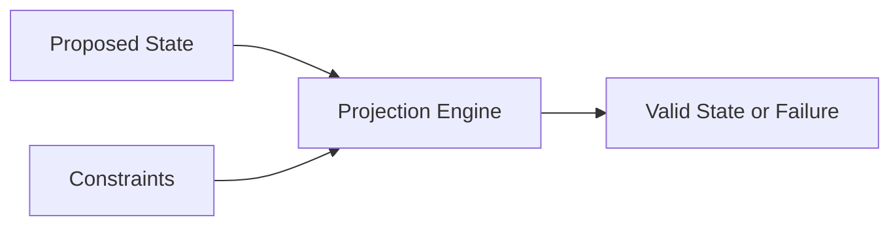

### FIG. 2 — DoF Extraction and Reconstruction

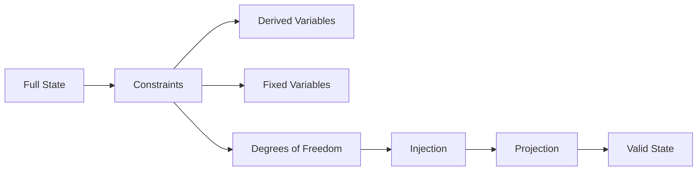

### FIG. 3 — Epoch-Based Projection

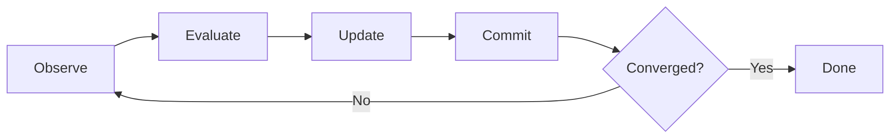

### FIG. 4 — Hardware Constraint Fabric

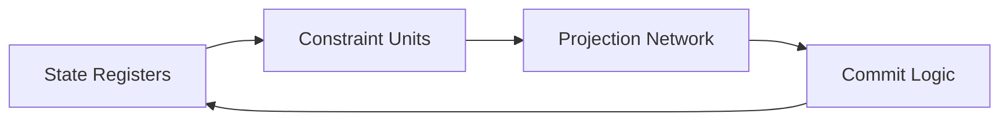

### FIG. 5 — CPAC Pipeline

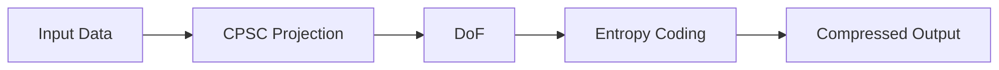

### FIG. 6 — Recursion-Stability Validation

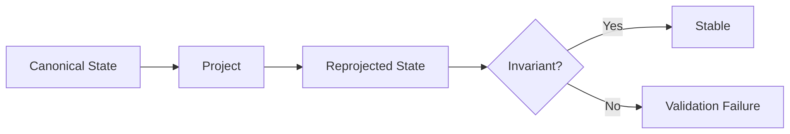

### FIG. 7 — AI Governance Layer

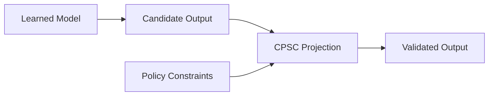

### FIG. 8 — Hardware Realm Governance

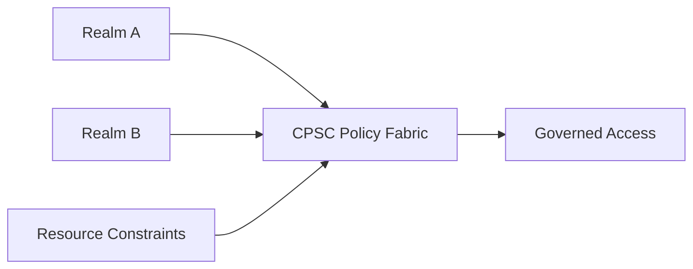

### FIG. 9 — Semantic System Specification Layer and Execution Backends


### FIG. 10 — Constraint-Projected Post-Quantum Verification Pipeline

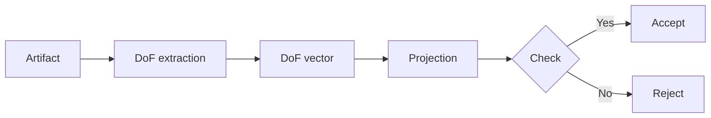

### FIG. 11 — Cryptographic State Manifold for Post-Quantum Signature

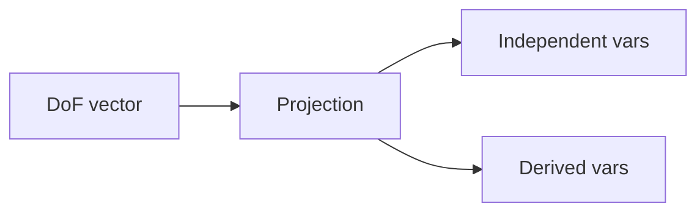

### FIG. 12 — Hardware Constraint Fabric for Post-Quantum Verification

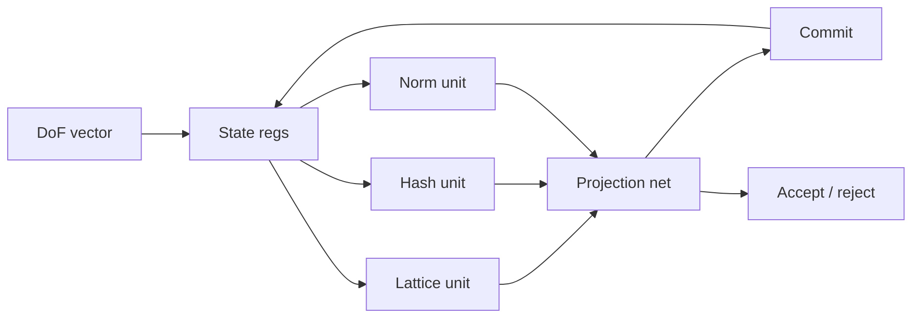

### 13. CPSC-Governed Agentic Development (CGAD)

## Provisional Patent – Background & Embodiment Specification (Draft)

---

## 1. FIELD OF THE INVENTION

The present disclosure relates to systems and methods for governing agentic artificial intelligence, software development, hardware development, and cyber-physical system workflows. More particularly, it relates to deterministic governance of agent-generated actions using constraint-projected state computing integrated with version control systems and external execution environments.

---

## 2. BACKGROUND AND PROBLEMS ADDRESSED

### 2.1 Agentic AI Limitations

Current agentic AI systems suffer from fundamental structural limitations, including but not limited to:

- Long-session slowdown due to unbounded context accumulation.
- Context drift between conversational intent, code artifacts, and real-world system state.
- Implicit authority assigned to agents through procedural workflows, approval logic, or orchestration frameworks.
- Inability to safely govern actions that affect hardware, remote systems, or cyber-physical infrastructure.
- Lack of deterministic reproducibility for agent-driven development sessions.

These limitations become acute in environments involving:
- Hardware/software co-design.
- Remote execution over secure channels (e.g., SSH).
- FPGA and SoC development flows.
- Continuous integration across heterogeneous tools.

---

### 2.2 Shortcomings of Existing Governance Approaches

Existing governance approaches rely on:
- Procedural approval pipelines.
- Human-in-the-loop reviews.
- Policy engines and rule-based orchestration.
- Tool-specific plugins or agent runtimes.

Such approaches:
- Encode authority procedurally rather than declaratively.
- Are brittle under scale and multi-agent interaction.
- Fail to provide mathematically enforceable invariants.
- Do not eliminate drift; they merely attempt to detect it post hoc.

---

## 3. SUMMARY OF THE INVENTION

The disclosed invention introduces a general-purpose framework for governing agentic systems using **Constraint-Projected State Computing (CPSC)** as a deterministic control plane.

In this framework:

- Agents are treated as untrusted proposal generators.
- All agent actions are modeled as proposed state transitions.
- Correctness, safety, and coherence are enforced exclusively through constraint-based projection of system state.
- Version control systems (e.g., Git) act as immutable ledgers of proposals and accepted state transitions.
- External execution environments (software, hardware, or hybrid) are incorporated as observable and reconstructible state.

Unlike prior art, authority is not granted to agents, workflows, or humans-in-the-loop, but is instead derived from explicit constraints over a declarative system state model.

---

## 4. CORE ARCHITECTURAL PRINCIPLES

### 4.1 Separation of Authority and Intelligence

- Agents generate proposals but do not decide correctness.
- Projection engines determine validity, not heuristics or policies.
- Conversations and prompts are non-authoritative and disposable.

---

### 4.2 State-Centric Governance

All system behavior is expressed in terms of:

- Explicit state variables.
- Declarative constraints.
- Deterministic projection into valid state space.

Intermediate execution steps have no semantic meaning unless they converge to a valid projected state.

---

### 4.3 Deterministic Drift Elimination

Context drift and long-session degradation are addressed by:

- Externalizing agent session summaries into explicit state.
- Forcing periodic projection and reconciliation.
- Rejecting invalid or incoherent accumulated assumptions.

---

## 5. GENERAL-PURPOSE GOVERNANCE FRAMEWORK

### 5.1 System Components

The framework consists of:

1. **Agents**
   - Human or AI-driven tools capable of proposing changes.
   - No embedded authority or persistence beyond proposals.

2. **Constraint Architecture Specification (CAS)**
   - Declarative description of system state and constraints.
   - Expressed in a machine-readable format (e.g., CAS-YAML).

3. **Projection Engine**
   - Resolves proposed state into validity or rejection.
   - Deterministic, bounded, and reproducible.

4. **Version Control Ledger**
   - Records accepted proposals and provenance.
   - Enables replay and auditability.

5. **Execution Observers**
   - Extract state from software, hardware, and external systems.
   - Feed observed facts into projection.

---

### 5.2 Canonical Governance Pipeline

```

Agent Action
→ Proposal Capture
→ State Injection
→ Constraint Projection
→ Accept or Reject
→ Ledger Recording

```

No step may be bypassed.

---

## 6. EMBODIMENT: AGENT-GOVERNED DEVELOPMENT WORKFLOW

### 6.1 Embodiment Overview

One embodiment applies the framework to a heterogeneous development environment comprising:

- A system-on-chip (SoC) with:
  - Processing System (PS) running an operating system.
  - Programmable Logic (PL) implemented via FPGA fabric.
- Remote access via secure shell (SSH).
- Hardware debugging tools (e.g., integrated logic analyzers).
- Agent-driven automation using terminal and code-generation tools.

---

### 6.2 Example State Model (Non-Exhaustive)

Representative state variables include:

- Hardware configuration identifiers.
- Bitstream identity and load status.
- Executable binary identity and runtime status.
- Debug instrumentation configuration.
- Test and benchmark results.
- Provenance metadata (commit identifiers, agent identity).

---

### 6.3 Example Constraints

Representative constraints include:

- Debug instrumentation may only be enabled when a compatible hardware configuration is active.
- Executable code may only run when associated provenance is recorded.
- Benchmarks may only execute after regression tests pass.
- Remote access credentials must be declared and validated.

---

### 6.4 Agent Interaction Model

Agents interact with the system by:

- Editing files.
- Executing commands.
- Proposing configuration changes.

All such interactions are captured as proposals and subjected to projection.

Agents receive only factual feedback describing constraint violations and observed state, without procedural guidance.

---

## 7. SESSION GOVERNANCE AND ANTI-DRIFT MECHANISMS

### 7.1 Session State as Governed State

Agent session characteristics (intent summaries, assumptions, active goals) are externalized into governed state variables.

---

### 7.2 Session Constraints

Constraints enforce:

- Bounded active goals.
- Mandatory refresh of assumptions after defined thresholds.
- Rejection of incoherent or contradictory session state.

This prevents long-session slowdown and cognitive drift.

---

## 8. PROMPT–CODE INSTRUMENTATION EMBODIMENT

### 8.1 Conversational State Modeling

Prompts, intent summaries, and unresolved questions are modeled as explicit state variables.

---

### 8.2 Constraint Binding Between Intent and Implementation

Constraints enforce relationships such as:

- Code changes must correspond to declared intent changes.
- Unresolved conversational ambiguities block acceptance.
- Implementation artifacts must cover declared intent scope.

---

### 8.3 Resulting Benefits

- Programming by dialogue becomes reconstructible and auditable.
- Code artifacts are explainable by construction.
- Hallucinated or implicit requirements are structurally excluded.

---

## 9. GENERALIZATION AND EXTENSIONS

The framework generalizes to:

- Multi-agent collaboration.
- Distributed systems governance.
- Safety-critical development.
- Certification and compliance workflows.
- Long-running autonomous system operation.

The same constraint-projected governance applies regardless of domain.

In some embodiments, the CGAD framework is instantiated concretely in:

1. **A hardware-centric DDF embodiment** in which Constraint-Projected State
   Computing is realized as a deterministic constraint fabric (for example, a
   proto-cell fabric with an epoch controller) and CGAD governs agentic
   workflows that modify or deploy that fabric. In such embodiments, a CGAD
   state may include, without limitation, fields describing the current
   phase (for example, Phase 1 or Phase 2 of a hardware development lifecycle),
   regression status, bitstream build mode, and sync/deploy requests. CGAD
   constraints enforce that hardware deployment or on-board benchmarking occurs
   only when regression is green, the bitstream has been rebuilt in an
   appropriate mode, and phase boundaries are respected. Agent proposals such as
   "rebuild bitstream", "sync to target", or "run regression" are treated as
   candidate state transitions and are accepted only when they project into a
   valid constrained state.

2. **A software-centric cpsc-python / CPAC embodiment** in which CPSC-based
   compression and benchmarking tools are governed by a CGAD profile. In such
   embodiments, a CGAD state may include, without limitation, fields describing
   the current set of referenced requirements, presence of a plan, regression
   status, whether repository Python entrypoints are invoked through a
   designated wrapper script, whether ledgers have been updated, and whether
   required benchmark profiles (for example, standard corpus runs) have been
   executed. Agent proposals such as "run benchmark", "update compression
   pipeline", or "push to git" are expressed as candidate state transitions and
   are accepted only if they satisfy declared constraints (for example, that
   non-trivial changes reference at least one requirement, that `save session`
   updates a ledger, and that benchmark-dependent work records fresh benchmark
   runs).

These embodiments illustrate, without limitation, how CGAD can be bound to
concrete hardware and software development environments while remaining governed
by a common constraint-projected state semantics.

---

## 10. ADVANTAGES OVER PRIOR ART

The disclosed system provides:

- Deterministic enforcement of correctness.
- Structural elimination of drift and session entropy.
- Tool-agnostic agent integration.
- Hardware–software unified governance.
- Reproducible and auditable development processes.

---

## 11. CONCLUSION

This disclosure describes a novel architecture for governing agentic systems by elevating constraints and state projection above agents, tools, and workflows. By treating intelligence as a proposal source and correctness as a mathematical property of state, the invention enables scalable, safe, and deterministic collaboration between humans, AI agents, software systems, and hardware platforms.

---

END OF PROVISIONAL PATENT APPLICATION
