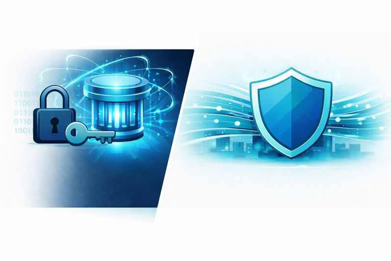
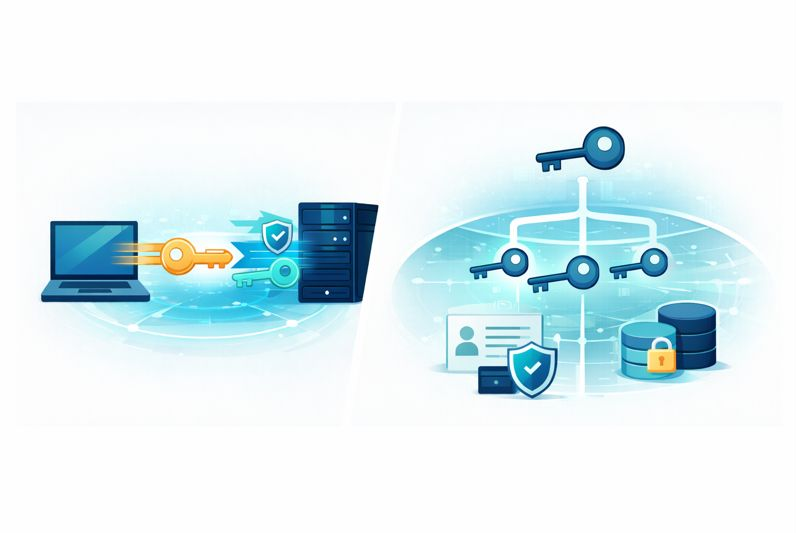

# Post-Quantum Cryptography (PQC)
## High-Level Overview

**Audience:** engineers, architects, technically literate readers.  
**Status:** high-level explainer, not legal or claim language.

---

## 1. Introduction

Classical public-key cryptography (like RSA and ECC) underpins almost all secure communication on the internet today. However, large-scale quantum computers will be able to break these schemes, putting long-lived data and systems at risk.

Our new post-quantum cryptography (PQC) embodiments provide a practical path to securing systems against both today's classical adversaries and tomorrow's quantum-capable attackers. This document explains, at a high level, how the pieces fit together and how our PQC approach can be integrated into real systems.

*Figure: Classical lock-and-vault security contrasted with a PQC shield protecting flowing data in motion.*

---

## 2. Why PQC, and Why Now?

### 2.1 The "harvest now, decrypt later" problem

Adversaries can record encrypted traffic today and store it until quantum computers are powerful enough to decrypt it. Sensitive information with a long lifespan (for example, personal data, intellectual property, medical or financial records) is particularly exposed.

Our PQC embodiments are designed to address this risk by:

- Replacing or augmenting vulnerable algorithms with quantum-resistant ones.
- Providing a migration path that works in existing infrastructures.
- Ensuring strong security now, and preserving confidentiality well into the future.

### 2.2 Standards and interoperability

Our approach is aligned with emerging industry standards in PQC and is designed to coexist with current protocols and infrastructure (for example, TLS-based systems, PKI, VPNs, and secure storage).

Image A (above) visually contrasts traditional lock-and-vault security with a modern shield protecting flowing data.

---

## 3. Architecture at a Glance

At a high level, our PQC solution introduces post-quantum algorithms into three main areas:

1. **Data in transit** – Protecting network connections between clients, servers, and services.
2. **Data at rest** – Securing stored data (databases, backups, archives) with quantum-resistant keys.
3. **Identity and lifecycle** – Managing keys, certificates, and identities in a way that is compatible with PQC.

These three areas are implemented through a set of modular "embodiments" that can be adopted individually or together, depending on the environment and risk profile.

*Figure: A central PQC core surrounded by three sectors for data in transit, data at rest, and identity and lifecycle, all connected in one architecture.*

---

## 4. PQC Core: Algorithms and Building Blocks

The PQC core is the foundation that all embodiments share. It abstracts:

- **Key encapsulation / key exchange** (for example, lattice-based KEMs).
- **Digital signatures** (for authentication, code signing, certificates, and so on).
- **Integration adapters** for existing protocols, libraries, and hardware.

You can think of the PQC core as a common cryptographic engine that:

- Provides well-tested PQC primitives.
- Offers a unified API for applications and services.
- Enforces policy (for example, algorithm selection, key sizes, rotation schedules).

Image B (above) illustrates this core and the three surrounding embodiments.

---

## 5. Embodiment A: PQC for Data in Transit

Embodiment A focuses on secure communication channels such as web traffic, APIs, and service-to-service links.

### 5.1 How it fits into existing protocols

Rather than replacing entire protocols, this embodiment:

- Integrates PQC key exchange into existing handshake flows (for example, within TLS or a similar secure transport).
- Optionally uses **hybrid modes**, combining a classical key exchange (like ECDHE) with a PQC key encapsulation mechanism to get the best of both worlds:
  - Classical security today.
  - Post-quantum security for the future.

### 5.2 End-to-end flow

1. The client initiates a secure connection to the server.
2. During the handshake, the client and server agree on:
   - A classical key exchange (optional, for backward compatibility).
   - A PQC key encapsulation mechanism.
3. Both parties derive shared session keys that are quantum-resistant.
4. Application data is then encrypted using symmetric ciphers, with keys derived from the PQC-protected handshake.

---

## 6. Embodiment B: PQC for Data at Rest

Embodiment B addresses stored data such as databases, object storage, backups, and long-term archives.

### 6.1 Key hierarchy

To make key management practical at scale, we use a layered key hierarchy:

- **Root or master keys** – Long-lived, PQC-protected, typically stored in secure hardware or vaults.
- **Data encryption keys (DEKs)** – Shorter-lived, used to encrypt specific databases, volumes, or files.
- **Per-record or per-object keys** – Optional, for highly sensitive or regulated fields.

PQC algorithms protect the master keys and any wrapping keys. DEKs and lower-level keys can remain symmetric but are ultimately anchored in PQC-secure roots.

### 6.2 Storage and backup flow

1. An application requests access to a dataset.
2. The key management service uses PQC-protected keys to derive or unwrap the appropriate DEKs.
3. Data is encrypted (or decrypted) on the fly using standard symmetric ciphers.
4. Backups and archives store only ciphertext and PQC-secured metadata.

---

## 7. Embodiment C: Identity, Signatures, and Lifecycle Management

Embodiment C focuses on identities (users, services, devices) and the cryptographic material that underpins trust:

- Certificates and certificate authorities (CAs).
- Code-signing keys.
- Firmware and software update channels.
- Audit logs, attestations, and non-repudiation records.

### 7.1 PQC signatures

To maintain trust in a post-quantum world, digital signatures must also be quantum-resistant. This embodiment introduces:

- PQC-based signature schemes for new certificates and identities.
- Hybrid certificates that include both classical and PQC signatures during a migration period.
- Support for PQC signatures in code signing and software distribution.

### 7.2 Lifecycle and policy

Lifecycle management includes:

- **Key generation** – Using PQC-compatible algorithms and entropy sources.
- **Rotation and expiration** – Ensuring keys are refreshed on a schedule appropriate to their risk profile.
- **Revocation** – Handling compromised or superseded keys and certificates.
- **Auditability** – Ensuring that all critical operations are logged and can be validated using PQC-secure signatures.

*Figure: On the left, a hybrid classical-and-PQC handshake between client and server; on the right, a key hierarchy protecting identities and locked databases for data at rest.*

---

## 8. Deployment Patterns and Integration

Our PQC embodiments are designed to be adopted incrementally, so organizations can:

- Start with a single, high-value use case (for example, protecting a critical API or database).
- Gradually extend PQC coverage across data in transit, data at rest, and identity management.
- Maintain interoperability with existing systems throughout the migration.

### 8.1 Common deployment patterns

- **Gateway or reverse-proxy deployment** – Introduce PQC at the edge (for example, load balancers, API gateways) with minimal changes to back-end services.
- **Service-mesh integration** – Embed PQC into service-to-service communication in a microservices architecture.
- **Storage-first deployment** – Begin by protecting long-term backups and archives, then move inward toward hot data.

---

## 9. Security and Performance Considerations

### 9.1 Security

- Uses algorithms with strong security reductions and active standardization support.
- Supports hybrid modes during migration to avoid single points of failure.
- Provides clear policies for algorithm agility so that components can be upgraded as standards evolve.

### 9.2 Performance and footprint

While some PQC algorithms have larger keys or signatures than classical schemes, our embodiments:

- Optimize handshake and key-management flows to limit overhead.
- Use caching, session resumption, and hardware acceleration where available.
- Allow per-application tuning (for example, selecting different algorithms or parameter sets for constrained devices versus high-performance servers).

---

## 10. Roadmap and Extensibility

As PQC standards mature and new algorithms are standardized, our architecture allows:

- Plug-and-play addition of new PQC algorithms.
- Phasing out of legacy algorithms without disruptive application changes.
- Extension into new domains, such as:
  - IoT devices and embedded systems.
  - 5G or 6G and edge computing.
  - Cross-organization data sharing and federated learning.

*Figure: An ascending staircase from classical keys, to hybrid key-plus-shield, to a globe protected by a PQC shield, representing the migration from classical crypto to a PQC-native ecosystem.*

---

## 11. Summary

Our PQC embodiments provide a comprehensive, modular approach to quantum-resilient security:

- **Embodiment A** secures data in transit with PQC-protected channels and hybrid handshakes.
- **Embodiment B** protects data at rest using PQC-anchored key hierarchies.
- **Embodiment C** safeguards identities, signatures, and lifecycle processes against quantum threats.

Together, they offer a practical, standards-aligned path from today's classical cryptography to a fully post-quantum-ready ecosystem.

This document is an informal overview and does not describe or limit any particular patent claims.

---

**PQC Overview** | © 2026 BitConcepts, LLC | Licensed under CPAC Research & Evaluation License v1.0
