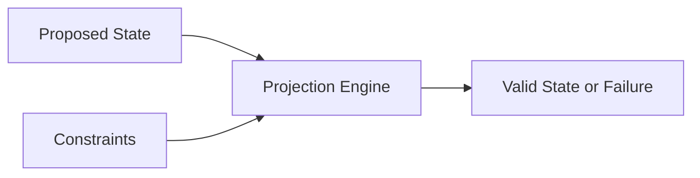
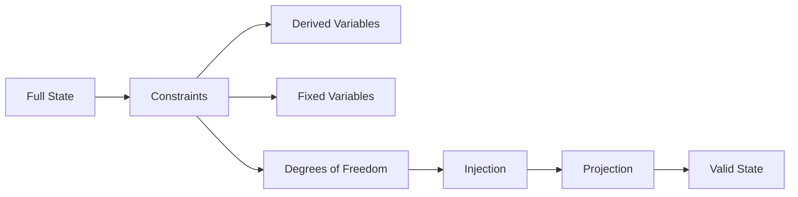
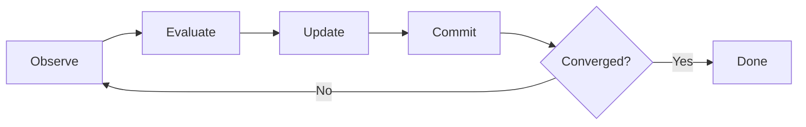
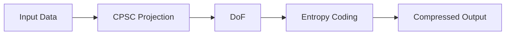
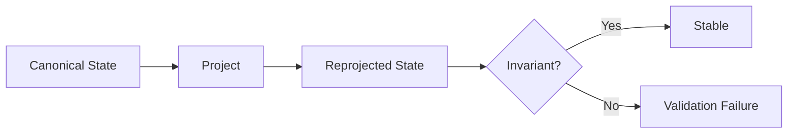
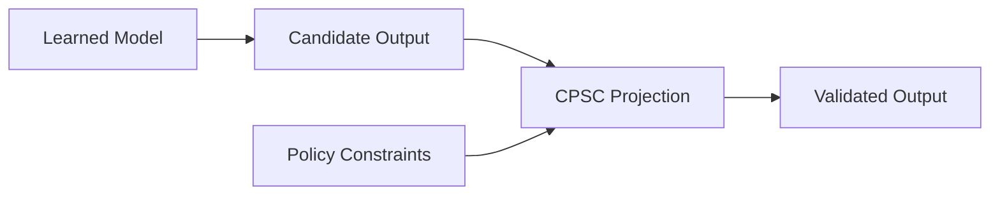
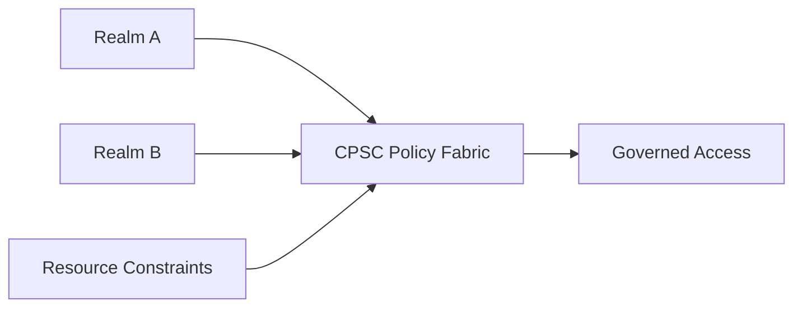

PROVISIONAL PATENT APPLICATION

CONSTRAINT-PROJECTED STATE COMPUTING SYSTEMS, SEMANTIC SYSTEM SPECIFICATION, AND APPLICATIONS

Inventor(s): Tristen Kyle Pierson
Applicant/Assignee: Tristen Kyle Pierson
Filing Date: TBD

---

1. TITLE

Constraint-Projected State Computing Systems, Semantic System Specification, and Applications

---

2. TECHNICAL FIELD

The present disclosure relates to computing systems and architectures. More particularly, the disclosure relates to deterministic computation performed by projecting system state into a space defined by explicit constraints, rather than by executing ordered instructions.

The disclosure further relates to methods for designing, specifying, and implementing such systems using a semantic system specification layer that expresses system intent, state roles, and invariant relationships independently of execution mechanics, and which is lowered into explicit constraint architectures suitable for execution by constraint-projected state computing engines.

The disclosed systems apply to both software and hardware implementations and support applications including, but not limited to, optimization, policy enforcement, scheduling, planning, configuration management, control systems, embedded sensing, security enforcement, real-time governance, artificial intelligence safety, mission-critical computing, and data compression.

---

3. BACKGROUND

Most contemporary computing systems are instruction-driven. Program execution is defined by ordered instruction streams, branching control flow, mutable execution state, and implicit runtime semantics. While effective for general-purpose computation, instruction-based systems are often ill-suited for domains governed primarily by rules, invariants, safety envelopes, policies, structural relationships, and correctness conditions.

Alternative approaches such as heuristic solvers, adaptive controllers, and machine-learned models frequently rely on probabilistic behavior, tuning, training, or stochastic execution. These approaches may lack deterministic replay, explicit failure modes, bounded convergence, or suitability for safety certification, particularly in embedded, real-time, or hardware-constrained environments.

Constraint programming systems and satisfiability solvers encode constraints declaratively, but typically operate as external solvers invoked episodically. Such systems do not define a unified execution model for system-wide state evolution, deterministic commit semantics, or continuous enforcement across software and hardware boundaries.

Optimization and numerical methods treat computation as convergence toward minima or fixed points of cost functions. These methods often rely on floating-point arithmetic, heuristic convergence criteria, or tolerance thresholds, and may not guarantee identical results across platforms, runs, or implementations.

Learned and adaptive systems, including neural networks and reinforcement learning systems, derive behavior from trained parameters rather than explicit constraints. Such systems may exhibit nondeterministic behavior, training drift, or opaque failure modes, and are difficult to certify for safety-critical or mission-critical applications.

In addition, existing system design practices frequently separate requirements documentation, implementation code, and validation logic, leading to semantic gaps between intended behavior and executed behavior. Correctness is often implicit, emergent, or distributed across code paths rather than explicitly declared.

Certain emerging computing paradigms, including quantum computing, further illustrate this gap. Existing quantum programming approaches typically describe low-level gate sequences, algorithm families, or Hamiltonian energy functions, and do not provide a stable, declarative layer for specifying what must be true of acceptable solutions, what constraints define correctness, or what invariants must hold across different hardware generations and algorithmic realizations. As a result, semantic intent is often entangled with execution methods and hardware details, complicating audit, governance, and long-term reuse.

None of these paradigms provide a unified model in which system behavior is specified declaratively in terms of semantic intent and invariants, and in which computation itself is defined as deterministic projection of system state into an explicitly constrained state space.

---

4. SUMMARY OF THE INVENTION

Constraint-Projected State Computing (CPSC) defines computation as a state-space operation rather than an instruction-execution process, establishing a paradigm in which correctness, determinism, and system behavior derive from explicit constraints and projection semantics rather than control flow or learned parameters.

In CPSC, a system is described by:

1. A finite set of state variables, and
2. A set of declarative constraints defining valid configurations of that state.

Computation consists of applying a deterministic projection process that resolves a proposed or initial state into a valid state satisfying the constraints, or deterministically reports failure when convergence cannot be achieved within declared bounds. Intermediate states are not semantically meaningful; only the final projected state has meaning.

In certain embodiments, the disclosed systems further include a semantic system specification layer used at design time to describe what a system does independently of execution mechanics. The semantic system specification identifies conceptual state elements, assigns roles indicating whether such elements are externally supplied, freely chosen, derived, or invariant, and declares invariant relationships that must hold among such elements.

The semantic system specification does not define instruction order, algorithms, solvers, or runtime behavior. Instead, it serves as a declarative description of system intent and correctness conditions. The semantic system specification is deterministically lowered into an explicit constraint architecture comprising concrete state variables, constraint expressions, and degrees of freedom suitable for execution by a CPSC engine. Lowering may be automated, semi-automated, or guided by configuration or policy.

In certain embodiments, CPSC identifies a minimal set of degrees of freedom representing independent variables sufficient to reconstruct a valid state. Fixed and derived variables need not be explicitly encoded or transmitted, enabling structural redundancy elimination, deterministic reconstruction, and efficient hardware mapping.

CPSC admits both software and hardware embodiments. In hardware embodiments, CPSC may be realized as a deterministic constraint fabric operating without instruction execution, program counters, or runtime interpretation. State updates occur only at declared commit boundaries, enabling deterministic replay, bounded execution, and suitability for safety-critical systems.

The disclosure further describes Constraint-Projected Adaptive Compression (CPAC), an application of CPSC in which structural redundancy is eliminated via constraint projection and degree-of-freedom extraction prior to optional prediction and conventional entropy coding. In such embodiments, projection and degree-of-freedom extraction occur first; any predictive components (including machine-learned or non-learned predictors) operate only over sequences of degrees of freedom, and entropy coding operates last over residual and/or degree-of-freedom streams.

Additional embodiments include deterministic optimization and satisfiability, real-time control, autonomous systems safety layers, hardware-based resource and security governance, artificial intelligence policy enforcement, configuration and planning systems, scheduling, validated telemetry and replay, and embedded low-power systems.

In some embodiments, the semantic system specification and corresponding constraint architectures define a stable, execution-independent intent layer for heterogeneous backends, including but not limited to classical processors, quantum computing systems, neuromorphic or analog accelerators, and learned or data-driven models such as neural networks, reinforcement learning agents, and large language models. In such embodiments, correctness conditions, invariants, and acceptable outcomes are defined declaratively at the semantic specification level, and one or more execution backends are selected, combined, or replaced over time without changing the specification.

The disclosed embodiments are illustrative and non-limiting.

---

5. BRIEF DESCRIPTION OF THE DRAWINGS

FIG. 1 — High-level CPSC computation model
FIG. 2 — Degrees-of-freedom extraction and reconstruction
FIG. 3 — Deterministic epoch-based projection schedule
FIG. 4 — Hardware constraint fabric architecture
FIG. 5 — CPAC compression and decompression pipeline
FIG. 6 — Recursion-stability validation (validation-time only)
FIG. 7 — AI or learned-system governance using CPSC
FIG. 8 — Hardware-based resource and security governance
FIG. 9 — Semantic system specification and lowering pipeline

---

6. DEFINITIONS (NON-LIMITING)

State: A collection of variables representing a system configuration.
Constraint: A declarative, side-effect-free rule defining a required relationship among variables.
Valid State: A state satisfying all applicable constraints.
Projection: A deterministic process mapping a proposed state to a valid state or to failure.
Degree of Freedom (DoF): An independent variable required to reconstruct a valid state.
Epoch: A discrete execution phase at which state updates are atomically committed.
Semantic System Specification (SSS): A design-time representation describing system intent, state roles, and invariant relationships independently of execution mechanics. In some embodiments, an SSS is expressed in a structured, human-readable text format, such as a YAML-based encoding sometimes referred to as "Semantic-YAML," although the particular syntax is not limiting.
Canonical Valid State: A deterministic representative valid state used for validation.

---

7. CONSTRAINT-PROJECTED STATE COMPUTING MODEL

7.1 State Model

A CPSC system operates on a finite set of state variables. Each variable has a defined type, domain, and optional metadata. Variables may represent logical assignments, numeric quantities, actuator commands, protocol fields, configuration values, resource allocations, or data-derived values.

7.2 Constraint Model

Constraints are declarative rules over one or more variables. Constraints are side-effect free, do not prescribe evaluation order, may overlap in scope, and define validity or objective structure. Constraints may be hard or weighted.

7.3 Projection Operation

Given a proposed state, a projection operator deterministically resolves the state into a valid configuration satisfying the constraints or reports failure under declared bounds. Projection may be iterative, staged, or bounded, provided determinism is preserved.

7.4 Determinism and Convergence

Determinism is enforced through explicit numeric modes and precision, bounded update magnitudes, fixed iteration or epoch limits, deterministic tie-breaking rules, and commit-only state updates. Identical inputs and configuration yield identical outputs or identical failure indications.

7.5 Epoch-Based Execution

In some embodiments, projection is structured into epochs comprising state observation, constraint evaluation, candidate update computation, and atomic commit. No state changes occur outside commit boundaries.

7.6 Degrees of Freedom

Variables may be classified as fixed, derived, or free. Degrees-of-freedom extraction yields a minimal independent representation sufficient to reconstruct a valid state via projection.

7.7 Recursion-Stability (Validation Only)

In some embodiments, CPSC supports an optional validation-time property referred to as recursion-stability. For a deterministic projection function P and a canonical valid state S, recursion-stability may require that P(S) equals S and that degrees of freedom remain invariant. This property is evaluated only during validation or certification and does not alter runtime semantics unless required by deployment.

7.8 Distinction from Solvers and Preprocessors

CPSC is not limited to a solver, preprocessor, filter, or auxiliary analysis step. Projection defines the primary computational mechanism by which system state is evolved, validated, reconstructed, or enforced across software and hardware systems.

---

8. SEMANTIC SYSTEM SPECIFICATION AND LOWERING

8.1 Semantic System Specification

In certain embodiments, systems are first described using a semantic system specification that expresses system behavior and correctness in terms of conceptual state elements, roles, and invariant relationships. The semantic system specification is independent of execution order, algorithms, solvers, numeric precision, or hardware details.

Each conceptual state element may be assigned a role indicating whether it is externally supplied, freely chosen, derived, or invariant. Relationships describe conditions that must always hold among state elements for the system to be correct.

8.2 Lowering to Constraint Architecture

The semantic system specification is deterministically lowered into an explicit constraint architecture. Lowering may include expanding conceptual elements into concrete variables, translating relationships into algebraic or logical constraints, and identifying degrees of freedom based on assigned roles. The result is a constraint model suitable for execution by a CPSC engine.

Lowering may be automated, semi-automated, or guided by configuration rules. Multiple constraint architectures may be derived from the same semantic system specification for different deployment contexts.

8.3 Advantages

This separation enables systems to be designed, reviewed, audited, and explained in semantic terms while retaining deterministic, constraint-based execution. It reduces semantic gaps between intent and implementation and enables formal validation, replay, and certification.

8.4 Backend-Agnostic Execution and Non-Von-Neumann Systems

In some embodiments, the semantic system specification and resulting constraint architecture are used to drive execution on heterogeneous and non-von-neumann computing systems. For example, a single semantic system specification may be lowered into:

1. A classical constraint-architected model executed by a deterministic CPSC engine or equivalent constraint-projected executor;
2. A quantum circuit or Hamiltonian encoding suitable for execution on a gate-based or annealing-style quantum processor;
3. A neuromorphic or analog computing fabric configured to evolve state according to equivalent constraints; or
4. A learned or data-driven model, such as a neural network or reinforcement learning agent, that proposes candidate states subject to the same constraint architecture.

In these embodiments, the semantic system specification and constraint architecture define correctness conditions and acceptable outcomes independently of the particular execution backend. Quantum, neuromorphic, analog, or learned systems are treated as interchangeable or complementary execution mechanisms operating under a common, constraint-defined semantics.

---

9. HARDWARE EMBODIMENTS

In hardware embodiments, CPSC may be implemented as a deterministic constraint fabric comprising state registers, parallel constraint evaluation units, projection or update networks, commit logic, and convergence detection. Such systems do not execute instructions, do not require program counters, and do not interpret data as code at runtime. Implementations may be realized in FPGA or ASIC.

---

10. SOFTWARE AND HYBRID EMBODIMENTS

Software embodiments implement equivalent semantics using deterministic projection engines. Hybrid embodiments combine software-managed semantic specifications with hardware constraint fabrics that perform projection and enforcement.

---

11. APPLICATION EMBODIMENTS (NON-EXHAUSTIVE)

11.1 Constraint Optimization and Satisfiability

Constraints encode satisfiability or optimization problems. Projection evolves assignments toward satisfaction or reduced cost deterministically. Weighted constraints may express preferences or objectives.

11.2 Configuration, Planning, and Scheduling

Systems generate configurations, plans, or schedules that satisfy hard constraints and optional preferences. Degrees of freedom represent choices, while derived variables are reconstructed via projection.

11.3 Policy and Authorization Enforcement

Access decisions are derived from requests, policies, and resource state. Projection ensures all policy rules are satisfied or deterministically denies access.

11.4 Real-Time Control and Safety Envelopes

Actuator commands are projected into constraint-defined safety envelopes, ensuring valid outputs without heuristic tuning.

11.5 Autonomous and Robotic Systems

Candidate actions proposed by learned or heuristic systems are projected into constraint-defined spaces encoding safety, dynamics, and policy rules.

11.6 AI and Learned-System Governance

Outputs from neural networks or language models are projected into constraint-defined state spaces encoding policy, safety, or structural rules. CPSC enforces correctness without interpreting semantic content.

In some embodiments, the same semantic system specification that defines policy, safety, or structural rules is also used to define observation, action, and state spaces for learned systems such as neural networks, reinforcement learning agents, or large language models. The semantic system specification and constraint architecture define which variables are externally supplied, which variables are freely chosen or proposed by a learned model, and which invariants must hold regardless of model parameters or training.

In these embodiments, learned systems act as proposal mechanisms for degrees of freedom or candidate states, and a CPSC engine or equivalent constraint-architected executor performs deterministic projection into the constraint-defined space. This arrangement decouples semantic correctness and policy enforcement from any particular neural architecture, training procedure, or deployment platform, and allows multiple learned models, classical solvers, or specialized hardware accelerators to share the same constraint-defined semantics.

11.7 Hardware-Based Resource and Security Governance

Constraints encode scheduling, power, memory, and access rules enforced directly in hardware.

11.8 Telemetry, Logging, and Replay

Telemetry is validated, reconstructed, and replayed deterministically using projection, enabling corruption detection and forensic analysis.

11.9 Embedded and Low-Power Systems

CPSC enables deterministic, explainable computation without reliance on neural inference, reducing energy consumption.

11.10 Constraint-Projected Adaptive Compression

In Constraint-Projected Adaptive Compression (CPAC), compression proceeds in three conceptual stages. First, CPSC or an equivalent constraint-architected system ingests raw input (for example, bytes, logs, telemetry frames, or token streams), maps this input into a constraint-architected state, and applies deterministic projection to obtain a minimal degree-of-freedom (DoF) representation. Structural constraints are enforced at this stage, and implied or derivable fields are removed.

Second, an optional predictor operates only over the degree-of-freedom representation (for example, per block or across blocks), producing predicted degrees of freedom. The encoder then forms residuals between actual and predicted degrees of freedom.

Third, an entropy encoder processes the residual stream and, in some embodiments, portions of the degree-of-freedom stream, to produce a compressed bitstream.

On decode, the pipeline is applied in reverse order. An entropy decoder reconstructs predicted degrees of freedom and residuals, which are combined to reconstruct the actual degree-of-freedom representation. This reconstructed degree-of-freedom representation is then injected into a CPSC projection engine to reconstruct a full valid state. Predictive components do not operate directly on raw input bytes; they operate only on the structured degree-of-freedom sequences produced by the projection stage.

11.11 Quantum and Non-Von-Neumann Execution Backends

In some embodiments, the disclosed semantic system specification and constraint-architected execution model are applied to quantum computing systems and other non-von-neumann architectures.

In one embodiment, a system designer specifies variables, constraints, degrees of freedom, and acceptable outcomes for a problem domain using a semantic system specification. The specification is lowered into a constraint architecture that is independent of any particular quantum gate set, qubit topology, Hamiltonian encoding, or quantum algorithm family. The same constraint architecture may then be compiled into one or more quantum realizations, such as a quantum circuit or an energy function suitable for annealing or variational algorithms, while preserving the declared constraints and acceptable outcomes.

In such embodiments, quantum hardware is treated as a probabilistic execution backend for the constraint architecture rather than as the location of semantic intent. Correctness conditions, invariants, and acceptable solution sets are defined declaratively in the semantic system specification and constraint architecture, and quantum programs or Hamiltonians are generated as one of several possible execution realizations.

In another embodiment, the same semantic system specification is used to target both quantum and classical backends. Classical solvers, heuristic optimizers, or deterministic CPSC engines may be applied to the constraint architecture alongside or in place of quantum execution. This enables hybrid classical–quantum systems in which different backends are selected or combined without changing the semantic specification of the problem.

In further embodiments, analogous techniques are applied to neuromorphic processors, analog computing systems, in-memory compute fabrics, or other non-von-neumann architectures. These backends may realize the constraint architecture using spiking dynamics, continuous-time evolution, or other non-instructional mechanisms, while the semantic system specification continues to define the intended variables, constraints, and acceptable outcomes independently of the underlying hardware.

11.12 Learned Predictor Embodiments for Constraint-Projected Adaptive Compression

In some embodiments, Constraint-Projected Adaptive Compression employs a learned prediction stage operating in the semantic degree-of-freedom space defined by a semantic system specification and corresponding constraint architecture. In these embodiments, raw input is first mapped into a constraint-architected state and projected by a CPSC engine into a minimal DoF representation as described above. The learned prediction stage operates only on sequences of such degrees of freedom, which are by construction consistent with the underlying constraints, and produces predicted degrees of freedom and, in some embodiments, probability distributions or auxiliary features. A residual or distribution-based representation derived from the predictor output is then provided to the entropy coding stage.

In certain embodiments, the learned prediction stage is implemented using one or more of the following model families:

1. Linear models over degrees of freedom, in which each DoF or group of DoFs is predicted as a linear function of past DoFs within a block or across blocks.
2. Non-linear models such as multilayer perceptrons, convolutional networks, recurrent networks, or transformer-style sequence models that operate on tokenized or block-structured sequences of DoFs.
3. Class- or structure-aware models that condition predictions on semantic classes or roles derived from the semantic system specification, such as separate prediction heads for identifiers, numeric values, operators, or other symbol categories.
4. Models that consume additional structural features derived from the constraint architecture or semantic specification, including but not limited to histograms, n-gram or bigram counts, repetition indicators, or scope or region markers, in combination with raw DoF histories.

In some embodiments, parameters of the learned prediction models are obtained by offline training on corpora of data. Training data may be prepared by using a CPSC engine and associated constraint architecture to project raw source data, such as code, logs, metrics, or telemetry, into sequences of degrees of freedom. Context–target pairs are then constructed, for example by treating a window of prior DoFs as input context and one or more subsequent DoFs as targets. A loss function, such as mean squared error for continuous-valued DoFs or cross-entropy loss for discrete-valued DoFs, is minimized over the training corpus to determine model parameters. Regularization, normalization, or other training techniques may be applied without departing from the scope of these embodiments.

In further embodiments, trained model parameters are quantized or otherwise adapted for deployment. For example, weights and biases may be quantized to fixed-point representations, such as 8-bit or 16-bit integers, and packed into a compact deployment format. Deployed models may be embedded directly in a compressed bitstream header, stored in a sidecar model file referenced by a model identifier carried in the bitstream, or obtained from a shared library or model registry addressable by such identifiers. In some embodiments, each compressed stream carries identifiers for both the constraint architecture or semantic system specification used to generate the degrees of freedom and the predictor model used to generate predictions, enabling decoders to select or load the correct combination.

In some embodiments, the interaction between the learned prediction stage and the entropy coding stage admits multiple variants. In a residual-based embodiment, the predictor outputs predicted degrees of freedom, residuals are formed between actual and predicted degrees of freedom, and the residual stream, optionally together with side information, is entropy coded. In a distribution-based embodiment, the predictor outputs a probability distribution or other parametric description over possible DoF values, and an entropy coder such as arithmetic or asymmetric numeral systems coding uses these distributions directly as coding models. In hybrid embodiments, outputs of the learned predictor are used to select among multiple entropy coding models, quantization granularities, or block partitioning strategies.

In additional embodiments, multiple predictor families are defined and used selectively. For example, different learned predictors may be trained for different data domains, such as source code, logs, or metrics, each paired with a corresponding semantic system specification or constraint architecture. Different performance profiles may also be provided, such as a low-complexity predictor for real-time or low-power operation and a higher-capacity predictor for maximum compression efficiency. In some embodiments, a mixture-of-experts arrangement is used in which, for each block or region, a selector chooses among a small set of predictor models based on local features or prior performance, and the selected model identity is recorded in a low-rate side stream that is decoded alongside the residual or distribution information.

In these embodiments, learning and prediction occur in the structured DoF space defined by constraints and the semantic system specification, rather than directly over raw bytes or unconstrained token streams. The overall CPAC pipeline therefore composes three separable and updatable elements: a constraint-architected projection stage that defines the semantic DoF space, a learned prediction stage operating within that space, and an entropy coding stage that encodes residual or distributional information. Multiple combinations of constraint architectures and learned predictors may be supported, with each compressed stream identifying the particular constraint model and predictor model used, while the underlying constraint-projected execution semantics remain unchanged.

---

12. NON-LIMITING STATEMENT

The foregoing description is illustrative and not limiting. Variations, modifications, and combinations fall within the scope of the disclosed invention. Optional validation properties do not restrict the scope of the computing paradigm.

---

## FIGURES

### FIG. 1 — High-Level CPSC Model



### FIG. 2 — DoF Extraction and Reconstruction



### FIG. 3 — Epoch-Based Projection



### FIG. 4 — Hardware Constraint Fabric


### FIG. 5 — CPAC Pipeline



### FIG. 6 — Recursion-Stability Validation



### FIG. 7 — AI Governance Layer



### FIG. 8 — Hardware Realm Governance



### FIG. 9 — Semantic System Specification Layer and Execution Backends

```mermaid
flowchart TD
    A[Semantic System Specification (SSS)<br/>e.g., Semantic-YAML]
    B[Constraint / Optimization Representation<br/>(Constraint IR, QUBO, Ising, Logic)]
    C[Execution Backends<br/>Classical • AI-Assisted • Quantum]

    A --> B
    B --> C
```

END OF PROVISIONAL PATENT APPLICATION
