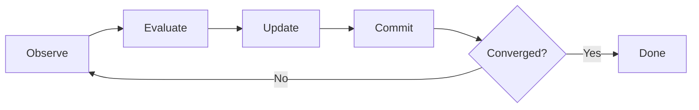
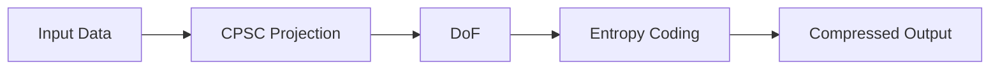
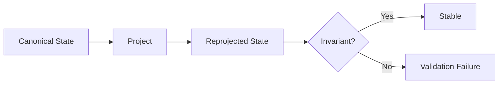
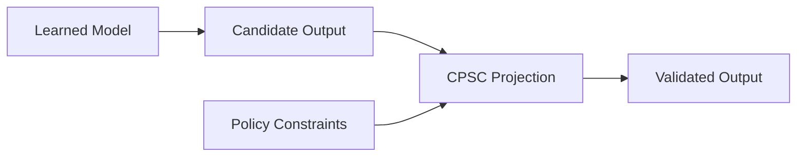
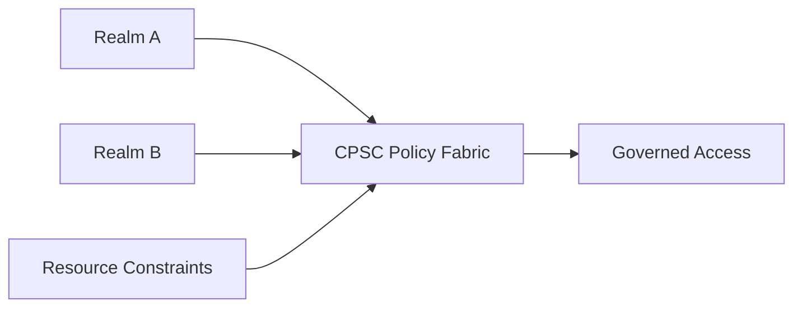

# PROVISIONAL PATENT APPLICATION

## CONSTRAINT-PROJECTED STATE COMPUTING SYSTEMS AND APPLICATIONS

**Inventor(s):** Tristen Kyle Pierson

**Applicant/Assignee:** Tristen Kyle Pierson

**Filing Date:** TBD

---

## 1. TITLE

**Constraint-Projected State Computing Systems and Applications**

---

## 2. TECHNICAL FIELD

The present disclosure relates to computing systems and architectures. More particularly, the disclosure relates to deterministic computation performed by projecting system state into a space defined by explicit constraints, rather than by executing ordered instructions. The disclosed systems apply to both software and hardware implementations and support applications including, but not limited to, data compression, optimization, control systems, embedded sensing, security enforcement, real-time policy governance, artificial intelligence safety, and mission-critical computing.

---

## 3. BACKGROUND

Most contemporary computing systems are instruction-driven. Program execution is defined by ordered instruction streams, branching control flow, mutable execution state, and implicit runtime semantics. While effective for general-purpose computation, instruction-based systems are often ill-suited for domains governed primarily by rules, invariants, safety envelopes, and structural constraints.

Alternative approaches such as heuristic solvers, adaptive controllers, and machine-learned models frequently rely on probabilistic behavior, tuning, training, or stochastic execution. These approaches may lack deterministic replay, explicit failure modes, bounded convergence, or suitability for safety certification, particularly in embedded, real-time, or hardware-constrained environments.

Accordingly, there exists a need for a computing paradigm in which correctness and behavior derive from explicit constraints, deterministic execution, and bounded projection semantics, rather than instruction sequencing or adaptive learning.

### Limitations of Existing Computational Paradigms

Instruction-driven computing systems define computation as the execution of ordered instructions over mutable state. Correctness and behavior emerge from program structure, control flow, and runtime interpretation. Such systems are inherently sequential in semantics, even when parallelized, and require explicit handling of invariants, safety conditions, and error states within program logic.

Constraint programming systems and satisfiability solvers encode constraints declaratively, but typically operate as external solvers invoked episodically. These systems are not designed as general-purpose computational substrates and do not define system-wide state evolution, commit semantics, or deterministic replay across arbitrary domains.

Optimization and numerical methods treat computation as convergence toward minima or fixed points of cost functions. These methods often rely on floating-point arithmetic, heuristic convergence criteria, or tolerance thresholds, and may not guarantee identical results across platforms, runs, or implementations.

Learned and adaptive systems, including neural networks and reinforcement learning, derive behavior from trained parameters rather than explicit constraints. Such systems may exhibit nondeterministic behavior, training drift, or opaque failure modes, and are difficult to certify for safety-critical or mission-critical applications.

None of these paradigms provide a unified model in which computation itself is defined as deterministic projection of system state into an explicitly constrained state space, independent of instruction sequencing, learning, or heuristic optimization.

---

## 4. SUMMARY OF THE INVENTION

CPSC defines computation itself as a state-space operation rather than an instruction-execution process, establishing a paradigm in which correctness, determinism, and system behavior derive from explicit constraints and projection semantics rather than control flow or learned parameters.

In CPSC, a system is described by:
1. A finite set of state variables, and
2. A set of declarative constraints defining valid configurations of that state.

Computation consists of applying a deterministic projection process that resolves a proposed or initial state into a valid state satisfying the constraints, or deterministically reports failure when convergence cannot be achieved within declared bounds. Intermediate states are not semantically meaningful; only the final projected state has meaning.

In certain embodiments, CPSC identifies a minimal set of **degrees of freedom (DoF)** representing independent variables sufficient to reconstruct a valid state. Fixed and derived variables need not be explicitly encoded or transmitted, enabling structural redundancy elimination, deterministic reconstruction, and efficient hardware mapping.

CPSC admits both software and hardware embodiments. In hardware embodiments, CPSC may be realized as a deterministic constraint fabric operating without instruction execution, program counters, or runtime interpretation. State updates may occur only at discrete commit boundaries, enabling deterministic replay, bounded execution, and suitability for safety-critical systems.

The disclosure further describes **Constraint-Projected Adaptive Compression (CPAC)**, an application of CPSC in which structural redundancy is eliminated via constraint projection and DoF extraction prior to optional prediction and conventional entropy coding.

Additional embodiments include deterministic optimization (e.g., SAT/MaxSAT), real-time control, autonomous systems safety layers, hardware-based resource and security governance, artificial intelligence policy enforcement, low-power embedded systems, and validated telemetry and replay.

The disclosure further introduces an optional, validation-time property referred to herein as **recursion-stability**, which detects semantic instability under repeated projection without impacting runtime execution.

The disclosed embodiments are illustrative and non-limiting.

---

## 5. BRIEF DESCRIPTION OF THE DRAWINGS

- **FIG. 1** — High-level CPSC computation model  
- **FIG. 2** — Degrees-of-freedom extraction and reconstruction  
- **FIG. 3** — Deterministic epoch/commit projection schedule  
- **FIG. 4** — Hardware constraint fabric architecture  
- **FIG. 5** — CPAC compression and decompression pipeline  
- **FIG. 6** — Recursion-stability validation (validation-time only)  
- **FIG. 7** — AI / learned-system policy enforcement using CPSC  
- **FIG. 8** — Hardware-based realm and resource governance  

---

## 6. DEFINITIONS (NON-LIMITING)

- **State:** A collection of variables representing a system configuration.
- **Constraint:** A declarative, side-effect-free rule defining a required relationship among variables.
- **Valid State:** A state satisfying applicable constraints.
- **Projection:** A deterministic process mapping a proposed state to a valid state or failure.
- **Degree of Freedom (DoF):** An independent variable required to reconstruct a valid state.
- **Epoch:** A discrete execution phase at which state updates are atomically committed.
- **Canonical Valid State:** A deterministic representative valid state used for validation.

---

## 7. CONSTRAINT-PROJECTED STATE COMPUTING MODEL

### 7.1 State Model

A CPSC system operates on a finite set of state variables. Each variable has a defined type, domain, and optional metadata. Variables may represent logical assignments, numeric quantities, actuator commands, protocol fields, or data-derived values.

---

### 7.2 Constraint Model

Constraints are declarative rules over one or more variables. Constraints:
- are side-effect free,
- do not prescribe evaluation order,
- may overlap in scope,
- may be hard or weighted,
- define validity or objective structure.

---

### 7.3 Projection Operation

Given a proposed state, a projection operator deterministically resolves the state into a valid configuration satisfying the constraints, or reports failure under declared bounds. Projection may be iterative, staged, or bounded, provided determinism is preserved.

---

### 7.4 Determinism and Convergence

Determinism may be enforced via:
- explicit numeric modes and precision,
- bounded update magnitudes,
- fixed iteration or epoch limits,
- deterministic tie-breaking rules,
- commit-only state updates.

Identical inputs and configuration yield identical outputs or identical failure indications.

---

### 7.5 Epoch-Based Execution (Example)

In some embodiments, projection is structured into epochs comprising:
1. State observation (read-only),
2. Constraint evaluation,
3. Candidate update computation,
4. Atomic commit.

No state changes occur outside commit boundaries.

---

### 7.6 Degrees of Freedom (DoF)

Variables may be classified as:
- fixed,
- derived,
- free (DoF).

DoF extraction yields a minimal independent representation sufficient to reconstruct a valid state via projection.

---

### 7.7 Recursion-Stability (Validation-Only)

In some embodiments, CPSC supports an optional validation-time property referred to as **recursion-stability**.

For a deterministic projection function \( P \) and a canonical valid state \( S \), recursion-stability may require:
- \( P(S) = S \), and
- \( DoF(P(S)) = DoF(S) \), where applicable.

Recursion-stability is evaluated only during validation, testing, or certification. Failure does not redefine runtime correctness unless required by a deployment context.

### 7.8 Distinction from Solvers, Filters, and Preprocessors

CPSC is not limited to a solver, preprocessor, filter, or auxiliary analysis step. In disclosed embodiments, projection defines the primary computational mechanism by which system state is evolved, validated, reconstructed, or enforced.

Unlike solvers that operate on isolated problem instances, CPSC defines system-wide state semantics and evolution. Unlike filters that accept or reject outputs, CPSC deterministically projects proposed states into valid states or reports failure. Unlike preprocessors, CPSC is not limited to data transformation but governs correctness and validity across software, hardware, and hybrid systems.

CPSC therefore constitutes a computational substrate rather than an auxiliary component.

---

## 8. HARDWARE EMBODIMENTS

In hardware embodiments, CPSC may be implemented as a deterministic constraint fabric comprising:
- state registers,
- parallel constraint evaluation units,
- projection/update networks,
- commit logic,
- convergence detection.

Such systems:
- do not execute instructions,
- do not require program counters,
- do not interpret data as code at runtime,
- may be implemented as static RTL on FPGA or ASIC.

Hardware embodiments may expose deterministic observables such as cycle count, epoch count, objective score, state hash, and termination reason.

---

## 9. SOFTWARE AND HYBRID EMBODIMENTS

Software embodiments implement equivalent semantics using deterministic projection engines and declarative models. Hybrid embodiments combine CPUs or MCUs with hardware constraint fabrics, where software loads models and hardware performs projection.

---

## 10. APPLICATION EMBODIMENTS (NON-EXHAUSTIVE)

### 10.1 Constraint Optimization (SAT / MaxSAT)

Constraints encode satisfiability or optimization problems. Projection evolves assignments toward satisfaction or reduced cost deterministically, reporting best results and convergence metrics.

---

### 10.2 Constraint-Projected Adaptive Compression (CPAC)

CPAC applies CPSC to eliminate structural redundancy prior to optional prediction and conventional entropy coding. Only degrees of freedom and residuals are encoded. Reconstruction uses projection to restore full valid state.

In CPAC, compression effectiveness derives from structural elimination of implied state rather than statistical redundancy alone. The reduction in encoded information results from constraint satisfaction and DoF identification, not from probabilistic modeling. As a result, CPAC remains correct and deterministic independent of prediction quality or entropy coding choices.

---

### 10.3 Real-Time Control and Safety Envelopes

CPSC computes actuator outputs by projecting proposed commands into constraint-defined safety envelopes. Unlike tuned controllers, constraints are explicit and projection deterministically yields valid commands or failure.

---

### 10.4 Autonomous and Robotic Systems

Learned or heuristic systems propose candidate actions or trajectories. CPSC projects these into constraint-defined spaces encoding dynamics, safety, and policy rules, ensuring deterministic enforcement before actuation.

---

### 10.5 AI / LLM / Neural Network Governance

CPSC and/or CPAC operate as deterministic governance layers for learned systems. Candidate outputs from neural networks or LLMs are projected into constraint-defined spaces encoding policy, safety, structural, or validity requirements. Projection may be applied pre-inference, post-inference, or between stages.

In these embodiments, CPSC does not interpret, understand, or modify semantic content, but enforces explicit structural and policy constraints over system state representations.

---

### 10.6 Hardware-Based Resource and Security Governance

CPSC enforces deterministic resource allocation and isolation across hardware realms. Constraints may encode scheduling policies, memory bandwidth limits, power envelopes, and device access permissions. Enforcement occurs in hardware without reliance on firmware or OS correctness.

---

### 10.7 Security, Integrity, and Tamper Resistance

Constraints encode access control, protocol invariants, and integrity rules. Invalid or unauthorized states are unreachable by construction. Projection failure may indicate tampering or policy violations.

---

### 10.8 Deterministic Telemetry, Logging, and Replay

CPAC encodes telemetry and logs by eliminating implied structure. Reconstruction via projection detects corruption and ensures valid replay for forensic or safety analysis.

---

### 10.9 Embedded and Low-Power Systems

CPSC operates on embedded devices to compute valid outputs under constraints without neural inference, reducing energy usage and enabling deterministic, explainable behavior.

---

## 11. NON-LIMITING STATEMENT

The foregoing description is illustrative and not limiting. Variations, modifications, and combinations fall within the scope of the disclosed invention. Optional validation properties, including recursion-stability, do not restrict the scope of the computing paradigm.

---

## FIGURES

### FIG. 1 — High-Level CPSC Model
```mermaid
flowchart LR
    S[Proposed State] --> P[Projection Engine]
    C[Constraints] --> P
    P --> V[Valid State or Failure]
````

### FIG. 2 — DoF Extraction and Reconstruction

```mermaid
flowchart LR
    S[Full State] --> C[Constraints]
    C --> D[Derived Variables]
    C --> F[Fixed Variables]
    C --> R[Degrees of Freedom]
    R --> I[Injection] --> P[Projection] --> V[Valid State]
```

### FIG. 3 — Epoch-Based Projection



### FIG. 4 — Hardware Constraint Fabric


### FIG. 5 — CPAC Pipeline



### FIG. 6 — Recursion-Stability Validation



### FIG. 7 — AI Governance Layer



### FIG. 8 — Hardware Realm Governance


